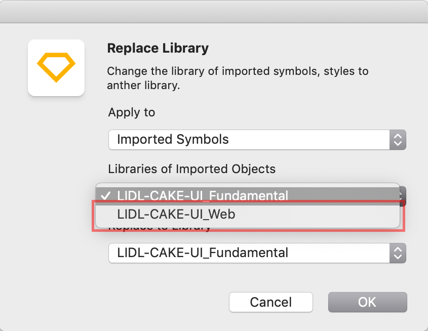

# Migration guide

## Update version 4.x to 5.x

### New Git repositories

- All CAKE library files are now at home in the Git repositories of Azure DevOps.
- Visit [setup](../../Getting\ started/Setup/Setup.md) and find a step-by-step tutorial how to get all future CAKE updates again.

### Global file renaming

- The name of **LIDL CAKE UI Core** has been changed to **LIDL CAKE UI Fundamental** due to the new library setup of some Lidl Digital's CI elements.
- The new LIDL CAKE UI Fundamental library only consists of symbols, text- and layer-styles that are *fundamental* to each of our products.

### Symbol transfer

- Some symbols have been moved from our LIDL CAKE UI Fundamental library (earlier CORE) to their explicit product library files (e.g. LIDL CAKE UI Web, App,…).
- Verify that all the following symbols are linked to the correct Sketch library:
  - Buttons
  - Forms
  - Tables

### Replace library

- Due to the symbol transfer you need to replace the symbols: buttons, forms and tables in every of your Sketch files with the help of the plugin **Automate**.

| Steps | Description | Preview |
|---|---|---|
| 1 |  After downloading the plugin click on "Plugins/Automate/Library" | |
| 2 |  Choose "Replace library" from the given options | |
| 3 | Switch the settings under "Libraries of Imported Objects" to the new symbol location (e.g. LIDL-CAKE-UI_Web) and confirm your changes with "OK" | |

### Symbol replacement

- The simple cookie alert no longer exists in our LIDL CAKE UI Web library.
- Please verify that you don't use the simple cookie alert anymore!
- Therefore replace the simple version with our current cookie alert.
