# Migration guide

## Update version 10.x to 11.x

### Lidl Plus Pricebox and Lidl Plus Coupons updates

Based on the legal info requirements the Lidl Plus Pricebox and Coupons had to be adjusted.

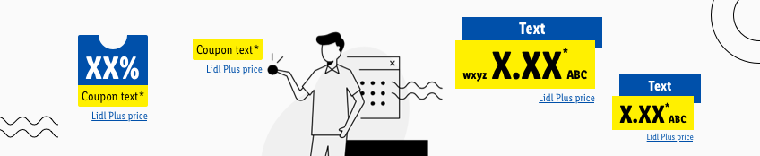

Ensure that the components fit to your exsiting layouts and please follow the steps below:

## Step 1: Update library
Ensure that you have connected the latest **library version**. Easily proof it in **Preferences/Libraries** 
Proof existing coupon or pricebox elements inside your layout.

## Step 2: Update Component
Select the existing component e.g Lidl Plus pricebox and replace it via symbol dropdown with the updated version.

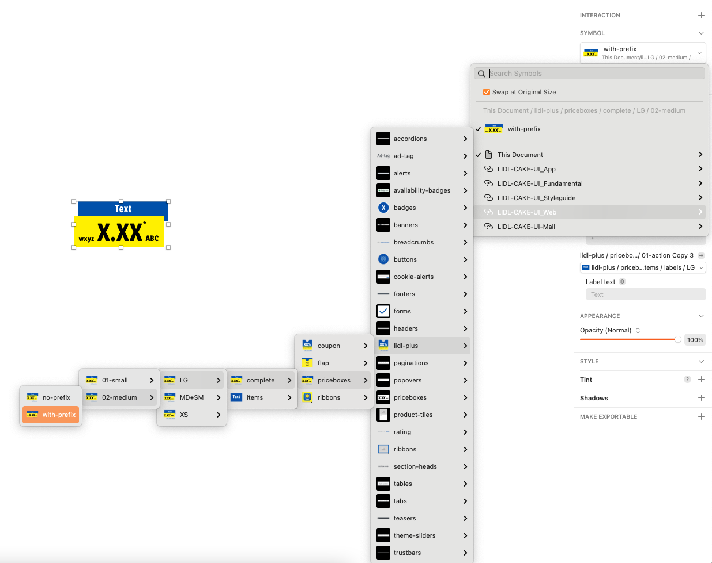

---

## Update version 8.x to 9.x and 9.x to 10.x

### New Grid margins and XS breakpoint

The new grid settings now provide more design options. The current Breakpoint XS has been updated to the latest data sets. 
To continue working on existing designs with the new grid settings, we recommend following these steps in Sketch:

### Step 1: Update the grid settings
Ensure that the **latest library version** is connected. Easily proof it over **Preferences/Libraries** 
Proof the **artboard sizes** for your project. 
Select your artboard and edit on the custom toolbar **View/Layout settings** or navigate on the menu item **View/Canvas/Layout settings**. Enter the new documented values for the selected breakpoint and confirm.

### Step 2: Update components

Description | Preview
---------|----------
 With an existing design, Sketch displays a notification at the top right corner.  ༼ つ ◕_◕ ༽つ Click on it! | 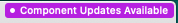 
 The Sketch interface shows a list of all changed components. Check the listed components and confirm the updates. | 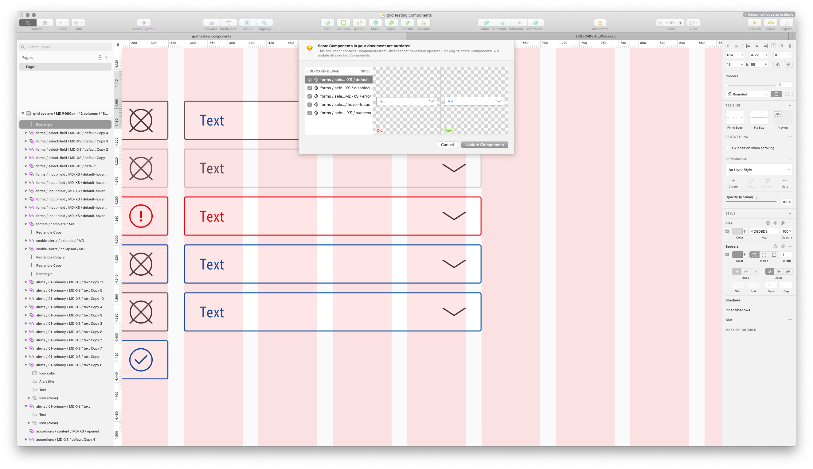
 Select the component on your artboard and choose the same component from the **Symbol drop-down** list to get the new sizes. | 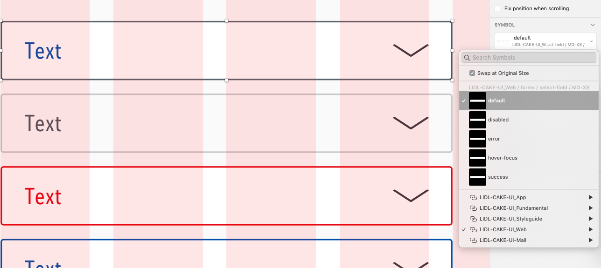
 ٩(^‿^)۶ Tadaaaa!!  The component should now fits on the new grid settings. | 

 A short workflow should demonstrate how easily it is to update your placed components on your designs.

 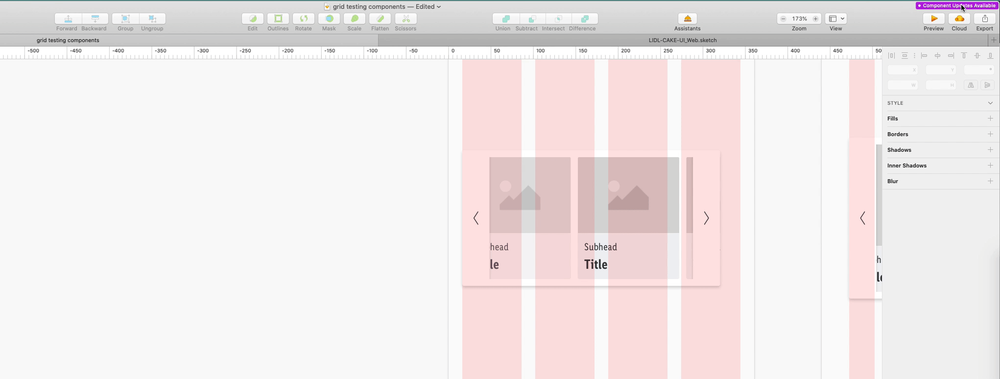

---

## Update version 7.x to 8.x

### New Pricebox updates

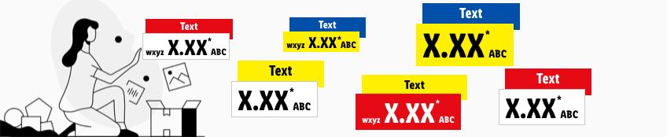

- The harmonization steps for our pricebox are now fully implemented in our library. Everything is ready to be used! To be sure that the sizes fit to the new spacing & measurements there are small steps that need to be done. We would like to offer our guidance for you:
  - Select your placed symbol, right click and "Set to Original Size"
  - If you have placed a single pricebox item, keep in mind to check the spacings between the items. Our updated documentation will help you out!
  - If you detached the pricebox symbol, please check if the connected text-styles e.g. the basic quantitiy text and the label now have their own text-style.

---

## Update version 6.x to 7.x

- We would like to keep our libraries and documentation up to date.
According to the official brand decision, the price box info is outdated. As a result, we are saying goodbye to this component in our Web, App and Mail libraries.

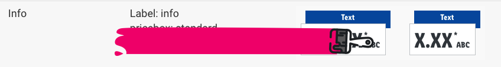

## Update version 5.x to 6.x

### New symbol setup

- All symbols in our CAKE products now use the following predefined settings:
  - **layer-styles** for correct styling or to indicate a possible state of a symbol.
  - **text-styles** with the correct alignment (center, left, right).

Don't worry! Replacing symbols in layer-styles is not as complicated as it seems. New layer-styles have been implemented in our LIDL CAKE UI Fundamental library to optimize the workflow with the LIDL CAKE UI Web library. Just try it!

- Update your LIDL CAKE UI libraries in Sketch:
  - Be sure to **compare** the changes in the overview carefully
  - Check your **layout and link your components** or texts with the new text & layer styles

### Replace color symbols

- As a result of the removal of the color icons from the pur LIDL CAKE UI Fundamental library, you should replace these icons in your components with our new layer styles.
- Here is a short workaround on how you can do this most easily and efficiently.

| Steps | Description | Preview |
|---|---|---|
| 1 | Display all used color symbols in your Sketch file by clicking on "Layer/Imported Symbols…" | 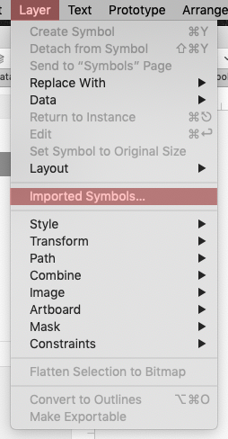 |
| 2| Select all displayed color symbols and unlink them from the original library file. _Hint: The symbols now appear on your "Symbols" page_ | 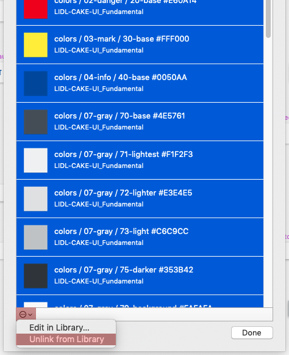|
| 3 | Select the artboard of **one** of the unlinked color symbols and run the plugin "[Symbol Instance Locator](https://github.com/sonburn/symbol-instance-locator?target=_blank)" | 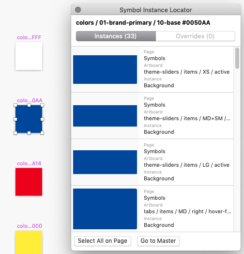 |
| 4 | Jump directly to the located color symbol in a component by clicking on one of the shown instances | 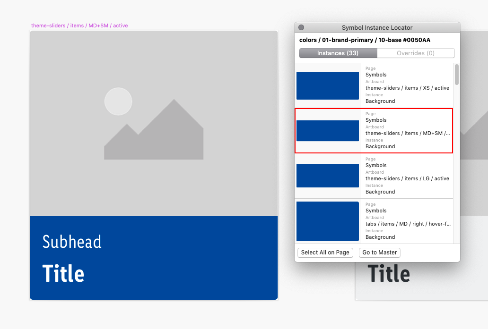 |
| 5 | Select the layer, detach it and update the occured shape with the desired layer-style. **Repeat this step** until there is no color symbol left in your document. _Hint: Run the plugin on the artboards again to be 100% sure_ | 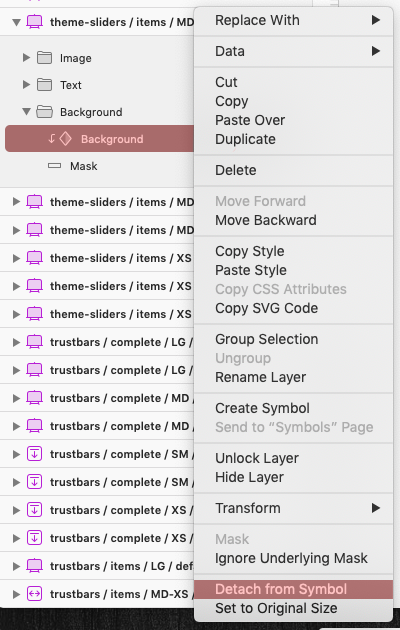 |
| 6 | Delete the artboard of the replaced color symbol _Hint: If you receive this notification from Sketch you didn't replace all color symbols with a layer-style_ | 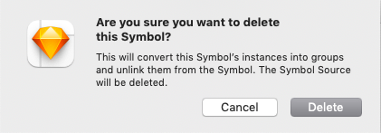|

---

## Update version 4.x to 5.x

### New Git repositories

- All CAKE library files are now at home in the Git repositories of Azure DevOps.
- Visit [setup](../../Getting\ started/Setup/Setup.md) and find a step-by-step tutorial how to get all future CAKE updates again.

### Global file renaming

- The name of **LIDL CAKE UI Core** has been changed to **LIDL CAKE UI Fundamental** due to the new library setup of some LIDL Digital's CI elements.
- The new LIDL CAKE UI Fundamental library only consists of symbols, text- and layer-styles that are *fundamental* to each of our products.

### Symbol transfer

- Some symbols have been moved from our LIDL CAKE UI Fundamental library (earlier CORE) to their explicit product library files (e.g. LIDL CAKE UI Web, App,…).
- Verify that all the following symbols are linked to the correct Sketch library:
  - Buttons
  - Forms
  - Tables

### Replace library

- Due to the symbol transfer you need to replace the symbols: buttons, forms and tables in every of your Sketch files with the help of the plugin **Automate**.

| Steps | Description | Preview |
|---|---|---|
| 1 |  After downloading [Automate](https://github.com/Ashung/Automate-Sketch?target=_blank) click on "Plugins/Automate/Library" | 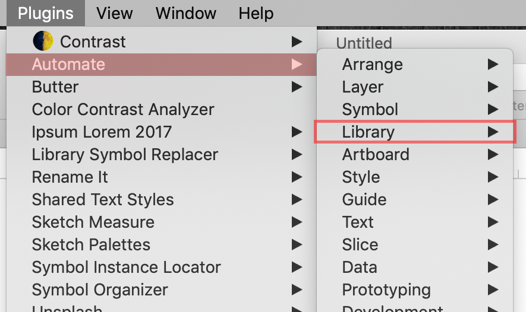|
| 2 |  Choose "Replace library" from the given options | 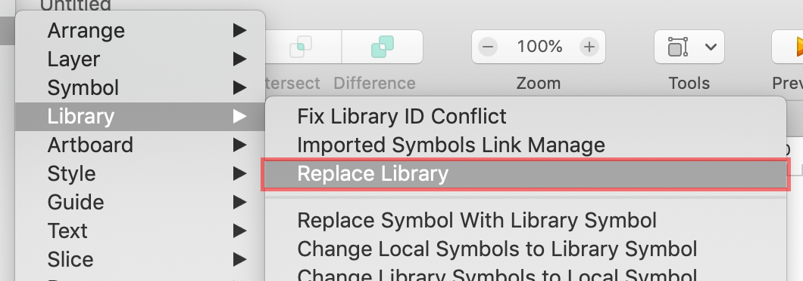|
| 3 | Switch the settings under "Libraries of Imported Objects" to the new symbol location (e.g. LIDL-CAKE-UI_Web) and confirm your changes with "OK" | 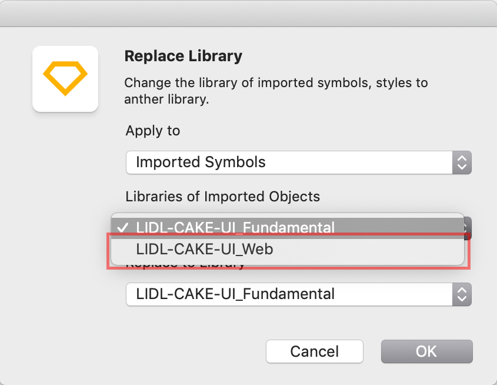|

### Symbol replacement

- The simple cookie alert no longer exists in our LIDL CAKE UI Web library.
- Please verify that you don't use the simple cookie alert anymore!
- Therefore replace the simple version with our current cookie alert.
