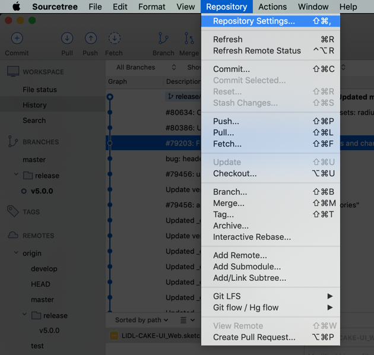
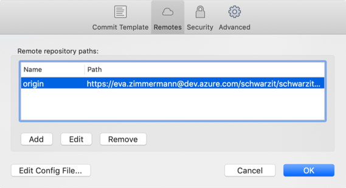
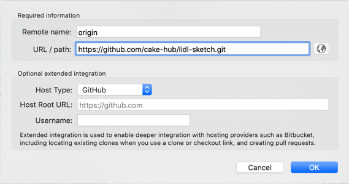

# Migration guide

## Update version 4.x to 5.x

### New Git Repositories

- All CAKE library files are now at home in the Git repositories of Azure DevOps.

### Global file renaming

- The name of **LIDL CAKE UI Core** has been changed to **LIDL CAKE UI Fundamental** due to the new library setup of some Lidl Digital's CI elements.
- The new LIDL CAKE UI Fundamental library only consists of symbols, text- and layer-styles that are *fundamental* to each of our product.

### Symbol transfer

- Some symbols have been moved from our LIDL CAKE UI Fundamental library (earlier CORE) to their explicit product library files (e.g. LIDL CAKE UI Web, App,…).
- Verify that all the following symbols are linked to the correct Sketch library:
  - Buttons
  - Forms
  - Tables

### Symbol replacement

- The simple cookie alert no longer exists in our LIDL CAKE UI Web library.
- Please verify that you don't use the simple cookie alert anymore!
- Therefore replace the simple version with our current cookie alert.

## How to change the repository settings?

- Please update the linking to the repositories to get all the updates of our libraries.

### Lidl on GitHub

- Copy the URL of the Lidl repositories that you needed for your project.

| Project | Link |
|---|---|
| Fundamentals | <https://github.com/cake-hub/lidl-sketch.git> |
| Web | <https://github.com/cake-hub/lidl-web-sketch.git> |

### Update your Repositories

| Steps | Preview |
|---|---|
| Open your **SourceTree** and **open the repository** that you want to update (e.g. Fundamental, Web, App, Mail, Chat) | |
| Go to **repository settings** |  |
| Select **remotes** and **double click on the remote repository path** or **click edit** |  |
| Update the path by **inserting the URL of the Project Repositories**. Finish update by clicking on **OK**. |  |

🎉 You did it! You’re now connected to the Repositories of the CAKE hub.

If you have any question or problems please don’t hesitate and contact us via the chat or at <cake@lidl.com>.
