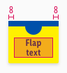
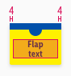
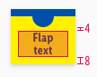
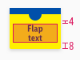
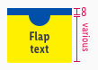
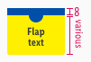
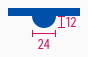
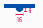
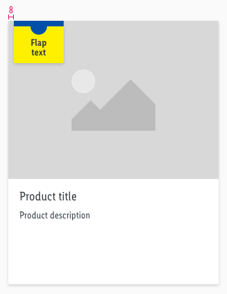

<AlertWarning alertHeadline="Not modifiable">
 It is mandatory to maintain the appearance and behavior of these components.
</AlertWarning>

# Lidl Plus

## Flap

Use the flap **only to promote Lidl Plus offers.**

---

### Overall styling

- The text style is **small-bold**.
- The text-color is **gray-darker**.
- The line height is **100%**.
- The color of the upper part always is **brand-primary-base**.
- The color of the lower part always is **mark-base**.
- The background-shadow is **shadow-default**.
- The background has **rounded corners of 2px on the lower-left and right side**.

---

### Recommendations

- **Use only one flap** in combination with a product tile, teaser or image.
- Keep the text short and at **maximum three lines** long.
- At best, the width of the flap should not overlap more than **50% of the underlying element**.

---

### Spacing & measurements

| Types | Attributes | Preview |
|---|---|---|
| Horizontal spacing | LG: 8px   MD-XS: 4px   text-alignment: centered |  |
| Vertical spacing | padding-top: 4px   padding-bottom: 8px |   |
| Height | top: 8px   bottom: height depending on content |   |
| Circle size | LG: 24 x 12px   MD-XS: 16 x 8px |  |

---

### Position

- A flap takes its place at the **upper left corner**.
- The distance of the flap to the upper left corner is **8px**.
- **Don't place several flaps** next to each other.

