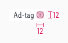
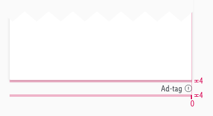

<AlertWarning alertHeadline="Not modifiable">
It is mandatory to maintain the appearance and behavior of these components.
</AlertWarning>

# Ad-tag

Ad-tag component shows to the user that certain component is used for advertising purpose. It is part of legal requirements for advertisements.

---

## Overall styling

- The text-style is [small](../../General/Typography/Typography.md#small).
- The line-height is set to **default**.
- The color is set to **gray-darker**.

### Ad-tag

- The symbol has a general basic-white background for image advertisements.
- The background can be changed to the transparent background when it is placed below a component, e.g. recommendation slider.
- The ad-tag with transparency background works only on light backgrounds such as e.g gray-background.
- The expression exclamation-circle is **optional** for banner elements.
- The expression exclamation-circle is **required** for Product Listing ads.
- The expression exclamation-circle icon triggers a [popover](../Popover/Popover.md).
- The text-length is limited to a **single word** only and must be plural if more than one ad is labelled with a single ad-tag.

| Size | Attributes | Preview | Variants |
|---|---|---|---|
| LG | text-color: gray-darker icon-color: gray-darker background-color: basic-white or transparent|  |  |
| MD-XS | text-color: gray-darker icon-color: gray-darker background-color: basic-white or transparent|  |   |

---

## Spacing & measurements

- The ad-tag is always placed on the bottom right area and is right aligned.

### Measurements

| Types | Attributes | Preview
|---|---|---|
| Horizontal spacing | padding: 4px |  |
| Vertical spacing | padding-top: 0px  icon is vertical centered |  |
| Height | LG: 20px MD-XS: 17px |  |
| Size | icon: 12x12px |  |

### Spacing

| Types | Attributes | Preview
|---|---|---|
| Spacing | minimum 4px below different components with transparent background  no other components should be placed in the same horizontal line |  |
| Spacing | 0px on images position: bottom right  |  |

---

## Examples

| Position | Preview |
|---|---|
| Image ad |  |
| Reco slider ad |   From legal perspective it is necessary to use the plural form of the text, so that it is clear that all products in the slider are ads. |
| Product tile ad|  |

---

### Our workflow in Sketch

- Use the "Overrides"-function to customize your ad-tag symbol (i.e. enter text, with-icon or none icon, choose background color).
