<AlertInfo alertHeadline="Modifiable">
Please ensure to comply with the corporate identity. A detailed list what can be modified can be found [here](#what-can-be-modified).
</AlertInfo>

# Alerts

Different types of notifications with contextual feedback about user actions as well as permanent presentation of important information.

---

## General information

**Our "info" alert matches our brand-primary color**. Blue is the best color to demonstrate an "info" alert from UX point of view, in our case and in online studies. Part of the LIDL brand colors is "blue" and also the "brand-primary-color" on a digital device. It didn't make sense to create a new color "blue" for an "info" purpose. That's why the "brand-primary-color" for LIDL matches the "info" color. But if, for example, the "brand-primary-color" for LIDL will change, only the components using the "brand-primary-color" will change. This has the benefit that all info elements will stay "blue".

---

## Recommendations

- **Keep the alerts text as short as possible. Especially the title.**
- Use an alert, i.e for feedback, product recalls or support.
- Use links in the alert with caution. It might be more appropriate to link the entire alert instead of one word.

---

## Overall styling

- The text style is [large bold](../../General/Typography/Typography.md#large-bold) for the **title** and [basic](../../General/Typography/Typography.md#basic) for the **text**.
- The line-height for the "alert title" is **120%**, it stays **140%** for the "alert text".
- Every variant uses the **darker-color** as **text-** and **icon-color**.
- The outline comes in **base-color**.
- The alert background always is the main-color's **background-color**.
- The border has a **thickness of 1px**.
- The components has **rounded corners of 2px**.
- It uses the **shadow-default**.
- All widths are individually adjustable and fit into the layout columns and the 8-point-grid.
- The height depends on the content and the additional components shown.
- Every alert comes with the icon "cross" as "close" -icon in the right upper corner.
- The color of the icon "cross" stays the same in the focus/hover state. Only the cursor changes to pointer.

### Title & icon

- Some alerts come with an additional fixed icon to emphasize their meaning.

| Version | Attributes | Preview |
|---|---|---|
| primary | text- & icon-color: brand-primary-darker outline-color: brand-primary-base background-color: brand-primary-background fixed icon: information-circle.svg | 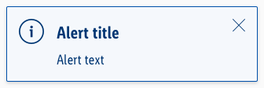 |
| info | text- & icon-color: info-darker outline-color: info-base background-color: info-background fixed icon: information-circle.svg |  |
| danger | text- & icon-color: danger-darker outline-color: danger-base background-color: danger-background fixed icon: exclamation-triangle.svg | 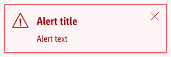 |
| success | text- & icon-color: success-darker outline-color: success-base background-color: success-background fixed icon: hook-circle.svg |  |
| warning | text- & icon-color: warning-darker outline-color: warning-base background-color: warning-background fixed icon: exclamation-circle.svg |  |
| gray / neutral | text- & icon-color: gray-darker outline-color: gray-base background-color: gray-background icon: not fix (currently placeholder.svg) | 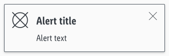 |

### Text

- Simple alerts to only display text.

| Version | Attributes | Preview |
|---|---|---|
| primary | text- & icon-color: brand-primary-darker outline-color: brand-primary-base background-color: brand-primary-background | 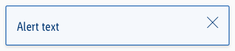 |
| info | text- & icon-color: info-darker outline-color: info-base background-color: info-background |  |
| danger | text- & icon-color: danger-darker outline-color: danger-base background-color: danger-background | 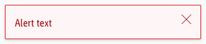 |
| success | text- & icon-color: success-darker outline-color: success-base background-color: success-background | 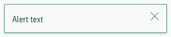 |
| warning | text- & icon-color: warning-darker outline-color: warning-base background-color: warning-background |  |
| gray / neutral | text- & icon-color: gray-darker outline-color: gray-base background-color: gray-background | 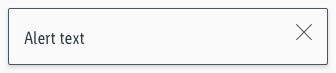 |

---

## Link

Some alerts use links to direct the user to another page.

- Every variant uses the **darker-color** as **text-color**.
- In the default/hover/focus state the **text-decoration** is **underline**.

| State | Attributes | Preview |
|---|---|---|
| Default / visited |  | 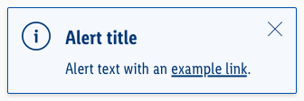 |
| Hover / focus | cursor: changes to pointer  |  |
| Active / pressed | text-decoration: none |  |

---

## Spacing & Measurements

| Types | Attributes | Preview |
|---|---|---|
| Horizontal spacing | padding: 16px | 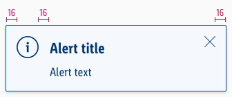 |
| Vertical spacing | padding: 16px margin-bottom: 8px | 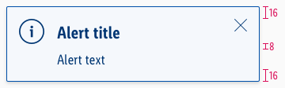 |
| Icon size | meaning: 32x32px close: 16x16px | 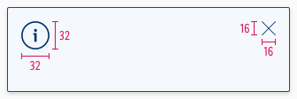 |

---

## Specials

- Alerts can also be used in their brand-primary color besides or with just a different meaning to the „info“-alert (i.e. „brand-primary“ or „wine“)

---

## What can be modified?

- Override the text and icons.
- Adjust the width and height according to the content.
- Modify alerts to your project needs by adding other symbols or styles (i.e. like dividers or links).

### Our workflow in Sketch

- Use the „Overrides“-function to select the required variant, to edit the content, to change the icon if necessary or if the alert can’t be closed.
