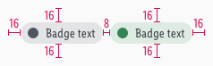
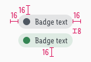

<AlertWarning alertHeadline="Not modifiable">
It is mandatory to maintain the appearance and behavior of these components.
</AlertWarning>

# Availability badges

Availability badges are mainly used to show the availability status of articles in both online store and in retail store.
They are usually positioned on product tiles and on the product detail page. 
If there is a need to display retail store availability on a map then use [store-locator-pins](https://www.cake.schwarz/Lidl/Web/Design/General/Icon/Icon.html#store-locator-pin).

---

## Versions

- There exist **5** availability badge versions for online and retail store.

Type | In stock | Low stock | Out of stock | No data | Info
---------|----------|---------|---------|---------|---------
 online store |  |  |  | - | 
 retail store |  |  |  |  |    

---

## Usage rules

- Don't show more than **two badges** on product tile or product detail page.
- The availability badges are displayed side by side on one line.
- The order of the availability badges starts with the retail store badge, followed by the online store badge.
- If the content inside the badges is too big for the space available, the badges are then placed right-aligned one below the other.
- If text inside the badge is too large for the space available within the product tile, it breaks into two lines.

---

## Overall styling

- The text-style is [small](../../General/Typography/Typography.md#small).
- The line-height is set to **120%**.
- The text-color is always **gray-darker**.
- It always has **12px rounded corners** and this includes the case when the badge has two lines of text.

### Online store

Title | In stock | Low stock | Out of stock | Info 
---------|----------|---------|---------|---------
 Preview |  |  |  | 
 Attributes | background: success-lighter   dot: success-base | background: mark-light   dot: mark-darker | background: danger-lighter   dot: danger-dark | background: gray-lighter

### Retail store

 Title | In stock | Low stock | Out of stock | No data | Info
---------|----------|---------|---------|---------|---------
Preview |  |  |  |  |    
 Attributes | background: success-lighter   dot: success-base | background: mark-light   dot: mark-darker| background: danger-lighter   dot: danger-dark | background: gray-lighter   dot: gray-base | background: gray-lighter

---

## Spacing & measurements

### Online store

| Types | Attributes | Preview |
|---|---|---|
| LG vertical spacing | icon and text are vertically centered |  |
| LG horizontal spacing | LG padding: 8px |  |
| MD-XS vertical spacing | icon and text are vertically centered |  |
| MD-XS horizontal spacing | MD-XS padding: 8px |  |
|dot | size: 12x12px |  |

### Retail store

| Type | Attributes | Preview |
|---|---|---|
| LG vertical spacing | icon and text are vertically centered |  |
| LG horizontal spacing | LG padding: 8px |  |
| MD-XS vertical spacing | icon and text are vertically centered |  |
| MD-XS horizontal spacing | MD-XS padding: 8px |  |
| dot | size: 12x12px |  |

### Two lines of text

- Icon size and horizontal spacings remain the same as in badges with one line of text, only the vertical spacings change.

| Type | Behavior | Preview |
|---|---|---|
| LG vertical spacing | icon remains in the same place as in the one-line badge and text is vertically centered within the badge shape |  |
| MD-XS vertical spacing | icon remains in the same place as in the one-line badge and text is vertically centered within the badge shape |  |

### Distances between availability badges (LG-XS) and their surroundings

- Horizontally and vertically availability badges have 8px paddings between themselves and 16px distance to all other objects or edges around them.

Type | Preview |
---------|----------|
 distances when badges are next to each other | 
 distances when badges are below each other | 
