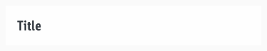
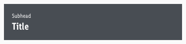
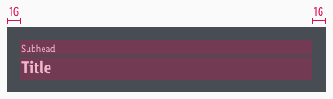
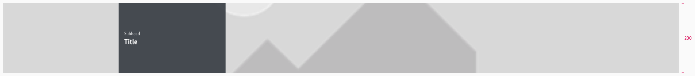
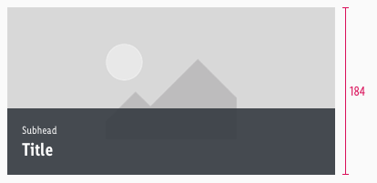
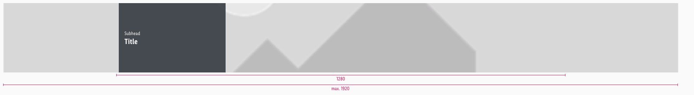

<AlertInfo alertHeadline="Modifiable">
Please ensure to comply with the corporate identity. A detailed list what can be modified can be found [here](#what-can-be-modified).
</AlertInfo>

# Banner

The banner element is mainly used in the upper section of a page.

It should give the user information about the following section through a title, subheadline and image.

---

## Recommendations

- Keep the text short and avoid line breaks.
- If you select a banner with text, look at it’s contrast to the picture (i.e. choose gray for an image with a bright subject and vice versa).

---

## Overall styling

- The title uses the text-style [large bold](../../General/Typography/Typography.md#large-bold).
- The subhead comes in the text-style [small](../../General/Typography/Typography.md#small).
- The line-height is **120%**.
- However, it has **no** hover or focus state.
- The background-color of a bar always has an opacity of **90%**.
- Its appearance and design is similar to the teaser component.

---

## Variants

- Bars can have two different states: **title** and **with-subhead**.
- They also are available in two colors: **light** and **dark**.

### Title

| Types | Attributes | Preview |
|---|---|---|
| light | text-color: gray-darker background-color: basic-white |  |
| dark | text-color: basic-white background-color: gray-darker |  |

### With subhead

| Types | Attributes | Preview |
|---|---|---|
| light | text-color: gray-darker background-color: basic-white |  |
| dark | text-color: basic-white background-color: gray-darker |  |

---

## Spacing & measurements

#### Spacing

| Types | Attributes | Preview |
|---|---|---|
| Horizontal spacing | padding: 16px *text is horizontally centered* |  |
| Vertical spacing | margin-bottom: 2px |  |

#### Measurements

- The width of the symbol always adapts to the viewport – up to a maximum of 1920px.

| Types | Attributes | Preview |
|---|---|---|
| Height | LG: 200px MD: 184px SM: 184px XS: 184px |     |
| Width | LG: 1280px (max. 1920px) MD: 960px SM: 600px XS: 320px |     |

---

## What can be modified?

- Override the text and bars.
- Adjust the width.

### Our workflow in Sketch

- Use the "Overrides"-function to change the bar of the banner.
