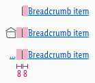

<AlertInfo alertHeadline="Modifiable">
Please ensure to comply with the corporate identity. A detailed list what can be modified can be found [here](#what-can-be-modified).
</AlertInfo>

# Breadcrumb

Indicate the current page’s location within a navigational hierarchy.

It is positioned near the header and displays navigational hierarchy to the customer, but is still interactive.

---

## Recommendations

- Based on the [Baymard studies](#references) we follow these recommendations:
  - "Display only the parent categories or subcategories to which the current product belongs."
  - "Avoid overcategorization."
  - "Don't wrap breadcrumbs to a second line."
- If the category page is the starting page then no breadcrumbs are shown.

---

## Overall styling

- The text-style is always [link small](../../General/Link/Link.md#text-styles-small).
- The line-height is set to **default**.
- The font size changes between LG and MD-XS breakpoint.
- The hover state changes the **mouse cursor into a link cursor (pointer).**
- On LG  **house.svg** is used as home-icon.
- The **pipe symbol** is used for separation of breadcrumbs.

| Types | Attributes | Preview |
|---|---|---|
| Default / visited |  text-color: brand-primary-base text-decoration: underline |  |
| Hover / focus |  text-color: brand-primary-darker text-decoration: underline |  |
| Active / pressed |  text-color: brand-primary-darker |  |

---

## Spacing & measurements

- The spacings are valid for all breakpoints (LG-XS).

| Types | Attributes | Preview |
|---|---|---|
| Horizontal spacing | padding: 8px |   |
| Vertical spacing | padding: 16px |  |
| Size | home icon: 16x16px | |
| Width | dependent on the text length of all breadcrumb levels |  |
| Pipe sign | height: LG: 13 px   MD-XS: 11px | LG-XS width: 1px |
---

## Behavior

- Breadcrumbs show only the categories/subcategories that lead to the current page, while the title of the current page (for instance article name) is never shown in the breadcrumbs.

### LG

If the horizontal space doesn't allow it, the last breadcrumb level is shortened by using an ellipsis without any blank space in-between. Clicking on the home icon leads user to the startpage.   

### MD-XS

Due to the lack of space on smaller screens breadcrumbs show the ellipsis followed by the last subcategory/category to which the current page belongs to. Tapping on the ellipsis leads the user to the topmost parent category.     The breadcrumb in combination with the home icon is only displayed when a single category page is shown. 

---

## What can be modified?

- Override the text.
- Adjust the width of a single symbol according to the text.

### Our workflow in Sketch

- The text-styles can be selected in the "Overrides"-function.
- The text can be changed using the "Overrides"-function.

---

## References

> UID-800 // Mobile Breadcrumb for SEO 
[Nielsen Norman Group - Breadcrumbs](https://www.nngroup.com/articles/breadcrumbs/) 
[Baymard - Breadcrumbs](https://baymard.com/blog/implementing-mobile-hierarchy-breadcrumbs)
