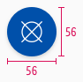
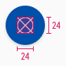
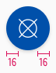
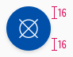
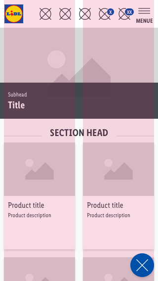
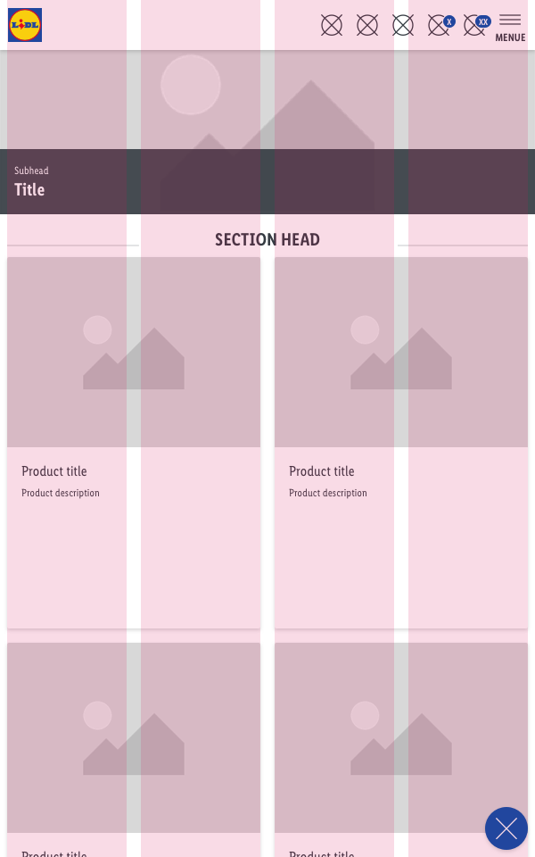
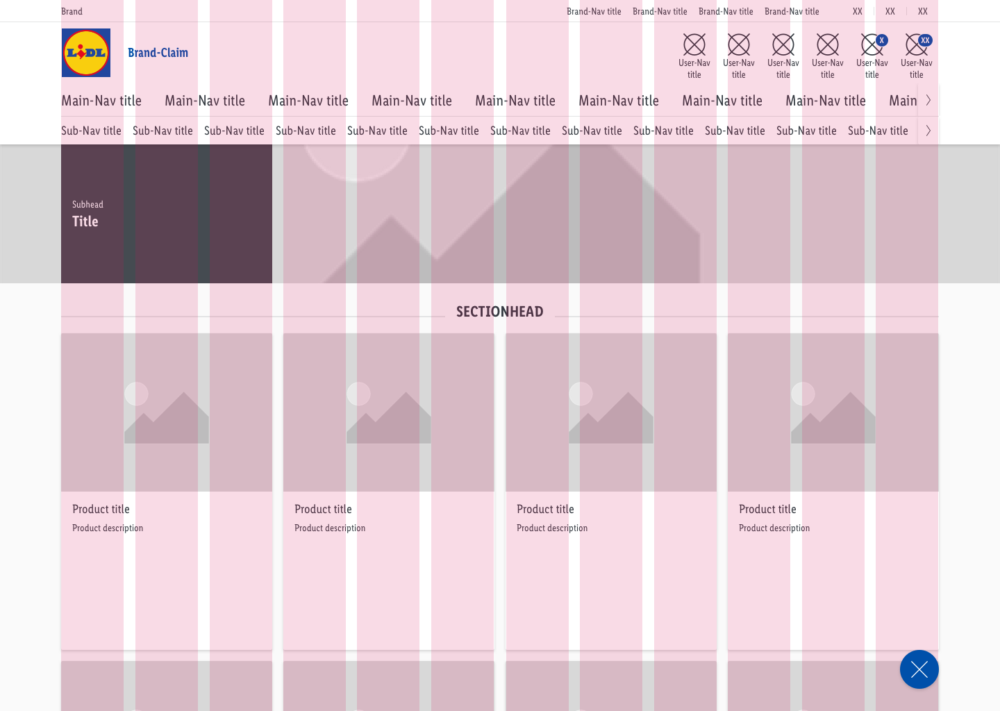

<AlertWarning alertHeadline="Not modifiable">
It is mandatory to maintain the appearance and behavior of these components.
</AlertWarning>

# Floating action button

A sticky button that floats over the content of the page. It always has the highest level of emphasis on the screen.

It supports the primary navigation and offers the user a fast option to navigate.

---

## Recommendations

### Do's

- Please ensure that the floating action button has a positive function (e.g. open a menu, share, more, etc.).
- Choose an icon that refers to the content behind the interaction with the button.
- Use the floating action button only once per web site.
- Use the button efficiently in the layout. Content such as image galleries, shopping basket, etc. does not suit the floating action button.

### Dont's

- Don’t overlay the floating action button with additional elements like badges.
- Don’t use the floating action button for negative functions (e.g. delete).
- Don’t change the shape of the floating action button.

---

## Overall styling

- The component always comes in the shape of a circle.
- It uses the shadow-default.

| Types | Attributes | Preview |
|---|---|---|
| Default | background: brand-primary-base icon-color: basic-white |  |
| Hover, focus and active | background: brand-primary-base _additional basic-black with 32% opacity_ icon-color: basic-white |  |

---

## Spacing & measurements

- The button comes in one size for every viewport.

| Types | Attributes | Preview |
|---|---|---|
| Size | 56x56px |  |
| Icon size | 24x24px |  |
| Horizontal spacing | 16px |  |
| Vertical spacing | 16px |  |

---

## Position & usage

- The optimal position for the floating action button is the lower right corner.
- This area is easily reachable for the user.
- Alternatively, it can also be placed in the lower middle or left.

| Types | Preview |
|---|---|
| Smartphone |  |
| Tablet |  |
| Desktop |  |

---

## What can be modified?

- Change the icon.
