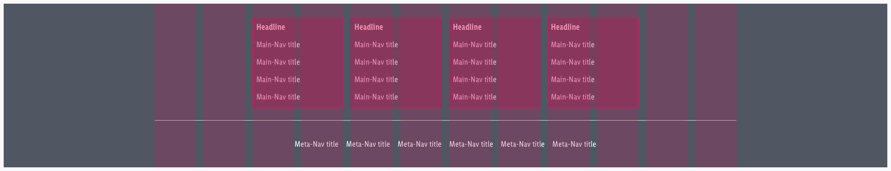

<AlertInfo alertHeadline="Modifiable">
Please ensure to comply with the corporate identity. A detailed list what can be modified can be found [here](#what-can-be-modified).
</AlertInfo>

# Footer

Use the footer to help the customer with additional information and navigation at the bottom of a website.

---

## Recommendations

- Keep the footer as short as possible. Do not load it with unnecessary information. The customer is interested in a first glance.
- Ideally, important links will be opened via a new window or a tab in the browser.

---

## Elements

The default footer contains the following elements:

1. Headline
1. Main-Navigation
1. Divider
1. Meta-Navigation
1. Background

### Usage of elements

| Headline | Main-Navigation | Meta-Navigation |
|---|---|---|
|This element is not absolutely necessary for the setup of a footer, unless you want to title or organize your main-navigation categories.|Use it to show a summary of all possible links or menus on a Lidl website (i.e. sitemap, wishlist, shopping cart, account, ...).|For information, such as legal (imprint, terms and conditions, data protection, ...) or contact, which must be placed on a website.|

---

## Overall Styling

- The text-color always is **basic-white**.
- The background-color is always **gray-base**.
- The divider width depends on the breakpoint but has always a **height of 1px** and the **color gray-lighter**.

| Types | Attributes | Preview |
|---|---|---|
|Headline|text-style: headline 5||
|Main-Navigation|text-style: basic||
|Meta-Navigation|text-style: basic||

## Status Styling

| Types | Attributes | Preview |
|---|---|---|
|Headline|For this element there is **no hover, focus, active** status.|---|
|Main-Navigation|text gets underlined background-color: gray-darker||
|Meta-Navigation|text gets underlined background-color: gray-darker||

---

## Spacing & Measurements

### Overall spaces

| Breakpoints | Measurements | Preview |
|---|---|---|
|LG|width: max. 1264px (the gray background expandes over the whole screen) vertical space: 32px horizontal space: 8px||
|SM|width: 944px vertical space: 32px horizontal space: 8px||
|MD|width: 584px vertical space: 32px horizontal space: 8px||
|XS|width: 304px vertical space: 32px horizontal space: 8px||

### Element spaces

| Element | Measurements | Preview |
|---|---|---|
|Headline|padding: 8px|
|Main-Nav|padding: 8px|
|Meta-Nav|padding: 8px|

---

## Variants

Alternatively, the footer can be arranged in columns instead of rows. This happens only for the desktop and tablet (landscape) breakpoint and if there are 3 rows or more in the main-navigation. The main-navigation always extends over 2 columns including Gutter and can add itself infinitely downwards.

| 3 columns | 4 colums |
|---|---|
|||

---

## What can be modified?

- Override the text.
- Adjust the width of single symbols according to the text.
- Add rows or columns.
- Switch between the two possible layouts (vertically or horizontically).
- Modify footers for your project needs by adding other symbols (i.e. input fields, badges, buttons, …).

### Our workflow in Sketch

- Use the „Overrides“-function to edit the content of the symbols:
  - main-navigation
  - meta-navigation
  - headline
