<AlertWarning alertHeadline="Not modifiable">
It is mandatory to maintain the appearance and behavior of these components.
</AlertWarning>

# Forms

Forms are used to accept the user's input. They can be displayed in many different ways: input- or select-fields, check boxes or radio buttons.

They are an important element in online shops, so it is even more essential that they are designed to be user-friendly. They serve to get information and guide the user through each task with minimal effort.

---

## Possible use cases

- Login and registration (check-in, check-out)
- Transaction (orders, payment)
- Contact (support, callbacks, requests)
- Data collection (lotteries, newsletters, surveys)
- Contribution (blogs, comments, posts)

---

## Recommendations

- Always try to keep the form and the text as short as possible!   A short form helps the user to get a fast overview and he recognizes easy what is required.
- If you use an input field as a single row or with a fixed height, demonstrate an overflow text (clipping) by an ellipse.
- If there is more than one option but only one can be selected, use a radio button instead of a checkbox.
- The open list of options in a select-field is always the native list of the browser.

---

## Overall styling

- Text-style is **basic**.
- Corners have a **2px** radius.
- Borders have a **1px** thickness.
- Hover or focus states are always shown with a border in **brand-primary-base**.
- Icon size is **24x24px**.
- **Important!** The colors of the icons follow the basic rules for icons.
- The background color is **basic-white**, except for the disabled state displayed in **gray-background**.

---

## Checkbox

- Choose a checkbox if the user must make one or more decisions about a particular element.
- Each checkbox in a group represents a separate and independent choice.
- Checked checkboxes use our "hook.svg" as icon.

| States | Attributes | Preview |
|---|---|---|
| Default | text-color: gray-darker border: gray-base |  |
| Hover / Focus | text-color: brand-primary-base  border: brand-primary-base  |  |
| Disabled | text-color: gray-base border: gray-light |  |
| Error | text-color: danger-base border: danger-base |  |
| Checked: Default | text-color: brand-primary-base border: gray-base icon-color: brand-primary-base |  |
| Checked: Hover / Focus | text-color: brand-primary-base border: brand-primary-base icon-color: brand-primary-base |  |
| Checked: Disabled | text-color: gray-base border: gray-light icon-color: gray-light |  |
| Checked: Error | text-color: danger-base border: danger-base icon-color: danger-base | |

---

## Radio button

- Choose a radio button if the user needs to select a single option from multiple options, or if you want the user to carefully consider the options and see all available ones.
- Selected radio buttons use our "bullet.svg" as icon.

| States | Attributes | Preview |
|---|---|---|
| Default | text-color: gray-darker border: gray-base |  |
| Hover / Focus | text-color: brand-primary-base border: brand-primary-base |  |
| Disabled | text-color: gray-base border: gray-light |  |
| Error | text-color: danger-base border: danger-base |  |
| Selected: Default | text-color: brand-primary-base border: gray-base icon-color: brand-primary-base |  |
| Selected: Hover / Focus | text-color: brand-primary-base border: brand-primary-base icon-color: brand-primary-base |  |
| Selected: Disabled | text-color: gray-base border: gray-light icon-color: gray-light |  |
| Selected: Error | text-color: danger-base border: danger-base icon-color: danger-base | |

---

## Input field

- Use input fields in the various states to show the user that he can enter data. They typically appear in forms and dialogs.

| States | Attributes | Preview |
|---|---|---|
| Placeholder | text-color: gray-base border: gray-base |  |
| Placeholder-Hover | text-color: gray-base border: brand-primary-base | 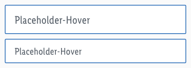|
| Focus (text input) | text-color: gray-darker border: brand-primary-base | 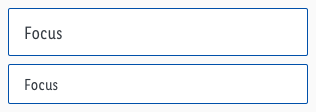 |
| Default | text-color: brand-primary-base border: gray-base |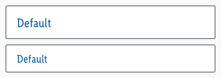 |
| Default-Hover | text-color: brand-primary-base border: brand-primary-base|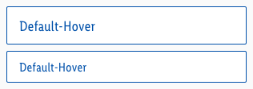 |
| Disabled | text-color: gray-base border: gray-light | 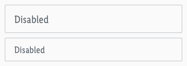 |
| Error | text-color: danger-base border: danger-base | 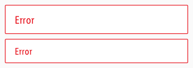 |
| Success | text-color: brand-primary-base border: brand-primary-base | 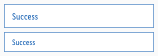 |

---

## Select field

- The select field is part of forms and opens a list of options.
- The consistent appearance of a select field compared to other form elements (input field, checkbox, etc.) is important and also refers to the different states.
- Select fields use our "down.svg" as icon.

| States | Attributes | Preview |
|---|---|---|
| Default | text-color: brand-primary-base border: gray-base icon-color: gray-darker |  |
| Hover / Focus | text-color: brand-primary-base border: brand-primary-base icon-color: gray-darker | 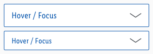 |
| Disabled | text-color: gray-base border: gray-light icon-color: gray-darker | 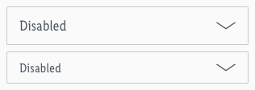 |
| Error | text-color: danger-base border: danger-base icon-color: gray-darker | 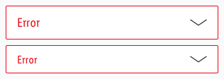 |
| Success | text-color: brand-primary-base border: brand-primary-base icon-color: gray-darker | 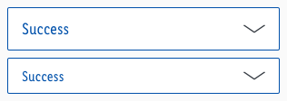 |

---

## Labels

- Labels are part of the input- or select field.
- They use **basic-bold** as label- and **basic** as optional-text.
- Give each form element a unique label.
- The **(optional)** part is fixed and is used for labels where user input isn't mandatory.

| States | Attributes | Preview | Combinations |
|---|---|---|---|
| Default | text-color: gray-darker |  |  |

---

## Spacing & Measurements

| Type | Attributes | Preview
|---|---|---|
| Horizontal  | 8px margin between radiobutton (or checkbox) and optional text   8px margin between label and optional text   16px padding|         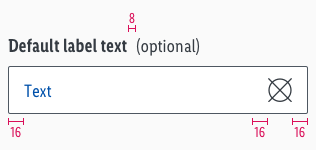 |
| Height | LG: 48px MD-XS: 40px Width depends on device and usage |  |
| Distance | 8px between form and label 32px between form blocks | 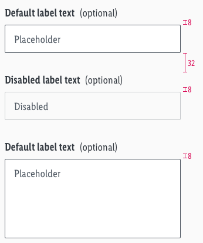 |

---

## Our workflow in Sketch

- Use the "Overrides"-function to enter text.
- Fill in "space" to show an empty input-or select field.
- Demonstrate the "hover" for "placeholder" and "default" by changing the outline color.
- If you don't want to show an icon, just select "None" in the "Overrides"-function.
- Pick the label symbol out of the library.
