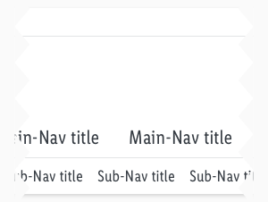
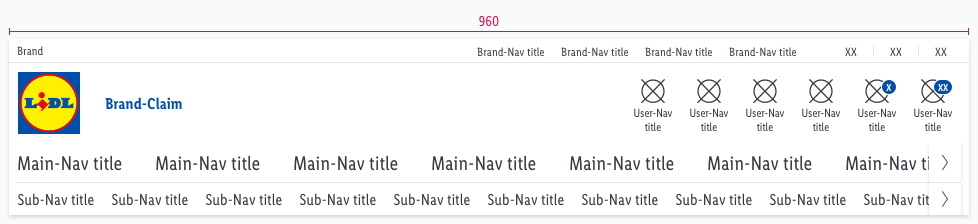
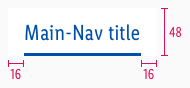
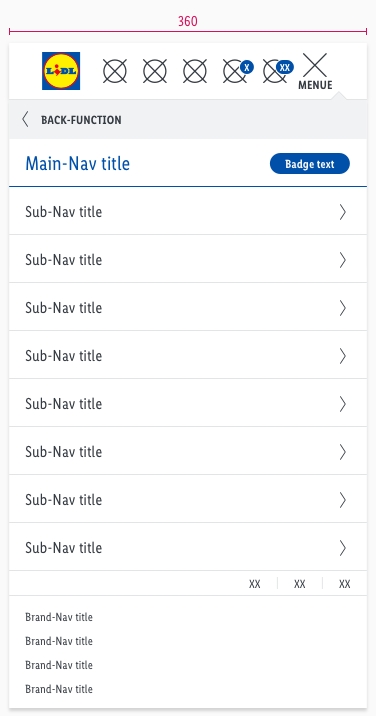
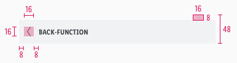

<AlertInfo alertHeadline="Modifiable">
Please ensure to comply with the corporate identity. A detailed list what can be modified can be found [here](#what-can-be-modified).
</AlertInfo>

# Header

The header is one of the essential components to create brand awareness.

The appearance symbolizes customers that they are on a LIDL page now. Its strongest supporting element is the LIDL logo with the brand claim.

---

## Recommendations

- Keep the globally known LIDL Logo in the header.
- Only change the brand claim regarding to your country.

---

## Elements

- The structure of the header is **modular**.
- It is a group of symbols and typography from the Core and UI Kit.
- If you combine the individual elements in Sketch, you get the header in various forms and for each breakpoint.
- There is a separate header layout for tablets (portrait) and smartphones:
  - A burger icon opens a dropdown menu with the main- and sub-navigation.
  - In combination with the back-function, our structure allows you to display an endless number of sub-navigation items.
- The header contains the **logo**, **typography: main-, sub-, brand-** and **user-navigation**, as well as **colors** and **shadows**.
- The header comes with a background-color in **basic-white**.
- It uses the **shadow-default**.

### Desktop & tablet landscape (LG & MD)

| Brand-navigation | User-navigation | Main-navigation | Sub-navigation |
|---|---|---|---|
| 1. Brand 2. Brand-navigation 3. Language 11. Divider | 4. Logo 5. Brand-Claim 6. User-navigation| 7. Main-navigation 8. Slider button 11. Divider | 9. Sub-navigation 10. Slider button |

### Tablet portrait & smartphone (SM & XS)

| Header | Flyout | Others |
|---|---|---|
| 1. Logo 2. User-navigation 3. Burger-menu | 4. Back-function 5. Main-navigation 6. Sub-navigation 7. Language 8. Brand-navigation 9. Badge 12. Dividers | 10. Overlay 11. Flyout |

---

## Main- & sub-navigation

- There are different types of use for each section of the navigation.
- Use the main-navigation for services that LIDL has to offer in your country (e.g. branch or special offers, online shop, travel, recipes …).
- Use the sub-navigation if a service has subitems (e.g. online shop with subcategories such as bicycle, fashion, household & kitchen …).

### Desktop & tablet landscape (LG & MD)

- The text-style for main-navigation is [large](../../General/Typography/Typography.md#large).
- The text-style for sub-navigation is [basic](../../General/Typography/Typography.md#basic).
- The line-height is set to **default**.
- The background-color is **basic-white**.
- The indicator is displayed in a different color for each state.
- The length of the indicator is based on the entered text.
- Its position is at the bottom of the element.

| Types | Attributes | Preview (LG & MD) |
|---|---|---|
| Default | text-color: gray-darker indicator: none|  |
| Hover / focus | text-color: gray-base indicator: gray-base |  |
| Active | text-color: brand-primary-base indicator: brand-primary-base |  |

### Tablet portrait & smartphone (SM & XS)

- The text-style for main-navigation is [large](../../General/Typography/Typography.md#large).
- The text-style for sub-navigation is [basic](../../General/Typography/Typography.md#basic), except the active state which is analog to the main-navigation.
- The line-height is set to **default**.
- The background-color is **basic-white**.
- The active main- & sub-navigation use a **small linked [badge-standard](../Badge/Badge.md#standard)** in brand-primary.
- The divider is displayed in a different color for each state.
- The length of the divider is the full width of the component.
- Its position is at the bottom of the element.
- The icon always is our "arrow-right".

| Types | Attributes | Preview (SM & XS) |
|---|---|---|
| Default | text-color: gray-darker icon-color: gray-darker divider: gray-lighter | |
| Hover / focus | text-color: gray-base icon: gray-base divider: gray-base |  |
| Active | text-color: brand-primary-base divider: brand-primary-base |   |

---

## User-navigation

- This area is for user guidance with support of icons.
- The most important elements for the user should be placed here (e.g. shopping cart or wishlist, leaflets, newsletter registration …).
- Keep the title of the user-navigation as short as possible.
- The title can be used in a two-line scenario, but should never be exceeded.
- The width of the component can be extended for the individual projects requirements.
- The icon is always centered above the text.
- The header has to be adjusted if the text for the title gets longer than specified as in our default component.
- Please ensure that the distance between the elements (icon and text) always stays the same.
- It uses the [badge-addon](../Badge/Badge.md#addon) to display a counter (e.g. how many products are in the shopping cart or wishlist).

### Desktop & tablet landscape (LG & MD)

- The text-style is [small](../../General/Typography/Typography.md#small).
- The line-height has **120%**.
- The background-color always is **basic-white**.

| Types | Attributes | Preview (LG & MD) |
|---|---|---|
| Default / active| text-color: gray-darker icon-color: gray-darker |  |
| Hover / focus | text-color: brand-primary-base icon-color: brand-primary-base |  |

### Tablet portrait & smartphone (SM & XS)

- It only uses an icon to symbolize a user-navigation category.
- The background-color is always **basic-white**.

| Types | Attributes | Preview (SM & XS) |
|---|---|---|
| Default / active| icon-color: gray-darker |  |
| Hover / focus | icon-color: brand-primary-base |  |

---

## Burger-menu

- The text-style always is [small bold](../../General/Typography/Typography.md#small-bold) and **uppercase**.
- The line-height is set to **default**.
- The background-color is always **basic-white**.
- Use this element only for tablets (portrait) and smartphones to demonstrate the main- and sub-navigation.
- In contrast to the user-navigation, a text is shown – limited to 5 letters.
- It uses our "bars-horizontal" icon to display a burger menu.
- The burger changes to our "cross" icon as a close function.

| Types | Attributes | Preview (SM & XS) |
|---|---|---|
| Default | text-color: gray-darker icon-color: gray-darker |  |
| Hover / focus | text-color: brand-primary-base icon-color: brand-primary-base |  |
| Active | text-color: gray-darker icon-color: gray-darker |  |

---

## Brand-navigation

- The text-style is [small](../../General/Typography/Typography.md#small).
- The line-height is set to **default**.
- Some LIDL countries have special pages to present their company (e.g. FAQ, responsibility, career …).

| Types | Attributes | Preview (LG / MD-XS) |
|---|---|---|
| Default | text-color: gray-darker  background-color: basic-white ||
| Hover / focus | text-color: gray-darker background-color: gray-lighter *the text gets underlined* ||

---

## Language

- The text-style is [small](../../General/Typography/Typography.md#small) and **uppercase**.
- The line-height is set to **default**.
- The active state comes with a round indicator in **brand-primary-base** and **1px outline in basic-white**.
- Required by countries that have to offer variants of the LIDL website in different national languages (e.g. Switzerland or Belgium).

| Types | Attributes | Preview (LG / MD-XS) |
|---|---|---|
| Default | text-color: gray-darker   background-color: basic-white ||
| Hover / focus | text-color: gray-darker background-color: gray-lighter *the text gets underlined* ||
| Active / selected | text-color: gray-darker  background-color: basic-white | |

---

## Back-function

- The text-style is [small bold](../../General/Typography/Typography.md#small-bold) and **uppercase**.
- The line-height is set to **default**.
- The recommended icon is **arrow-left**.
- There is **no** hover/focus or selected state.
- Use this element only for tablets (portrait) and smartphones.
- The user can go back to the previous navigation level by clicking on the link.

| Types | Attributes | Preview |
|---|---|---|
| Default | text-color: gray-darker background-color: gray-lightest icon-color: gray-darker |  |
| Example | Example of „back-function" on the symbol „dropdown-menu“ |  |

---

## Brand

| Types | Attributes | Preview (LG & MD) |
|---|---|---|
| Default | text-style: [small](../../General/Typography/Typography.md#small)
 text-color: gray-darker |  |

---

## Brand-claim

- This element only exists in desktop and tablet (landscape).

| Types | Attributes | Preview (LG & MD) |
|---|---|---|
| Default | text-style: [brand claim](../../General/Typography/Typography.md#brand-claim) text-color: brand-primary-base position: horizontally centered with logo |  |

---

## Divider, overlay & flyout

- Dividers are used in every breakpoint and therefore have different widths.
- The overlay and flyout component only exists in tablet (portrait) and smartphone devices.

| Types | Attributes | Preview |
|---|---|---|
| Divider | color: gray-lighter height: 1px |  |
| Overlay | background-color: basic-black opacity: 72% |  |
| Flyout | background-color: basic-white shadow: default-flyout |  |

---

## Spacing & measurements

- This section shows the different spacings of the desktop and mobile elements included in the header.

### Desktop & tablet landscape (LG & MD)

- All the spacing for these breakpoints are identical.
- Only the **height** and **width** of the used components are different.

#### Spacing

| Types | Attributes | Preview |
|---|---|---|
| Content | padding-left: 8px |  |
| Brand-claim | padding-left: 24px |  |
| Brand-navigation | padding: 16px (8+8) margin-right: 48px (8+24+16) |  |
| User-navigation | padding: 32px (16+16) |  |
| Main-navigation | padding: 32px (16+16) |  |
| Sub-navigation | padding: 16px (8+8) |  |

#### Measurements

| Types | Attributes (LG / MD) | Preview |
|---|---|---|
| Height | complete: 208px / 176px brand-navigation: 32px / 24px user-navigation: 88px / 80px main-navigation: 48px / 40px sub-navigation: 40px / 32px |   |
| Width | complete: 1280px / 960px |   |
| Logo | size: 72x72px / 64x64px |  |
| Main-navigation | padding: 16px height: 48px / 40px indicator: 3px |  |
| Sub-navigation | padding: 16px height: 48px / 40px indicator: 2px |  |
| User-navigation | padding: 16px margin-bottom: 2px height: 88px / 80px width: 64px / 56px icon-size: 32x32px / 24x24px |   |
| Brand-navigation | padding: 8px height: 32px / 24px  | |
| Language | padding: 16px height: 32px / 24px |  |

### Tablet portrait & smartphone (SM & XS)

#### Spacing

| Types | Attributes | Preview |
|---|---|---|
| Content | padding: 8px |  |
| User-navigation | padding: 16px (8+8) |  |
| Brand-navigation | padding: 8px | 

#### Measurements

| Types | Attributes | Preview |
|---|---|---|
| Height | complete: 56px back-function: 40px main-navigation: 48px sub-navigation: 48px language: 24px brand-navigation: depends on content  |  |
| Width | width: 600px / 320px flyout: 80% / 100% |  |
| Logo | size: 40x40px  |  |
| Back-function | width: depends on breakpoint icon-size: 16x16px padding: 8px height: 48px (includes arrow) arrow-size: 16x8px|  |
| Main-navigation | width: depends on breakpoint padding: 16px height: 48px divider: 1px |  |
| Sub-navigation | width: depends on breakpoint padding: 16px height: 48px divider: 1px |  |
| User-navigation | padding: 8px height: 56px width: 40px icon-size: 24x24px |  |
| Brand-navigation | padding: 8px  height: 24px ||
| Burger-menu | padding: 8px margin-bottom: 0px height: 56px width: 40px | |
| Language | padding: 16px height: 24px |  |

---

## Position

| Types | Attributes | Preview |
|---|---|---|
| Addon | padding-right: 8px (LG+MD) padding-right: 0px (SM+XS) |  |
| Language selection | padding-right: 10px (LG) padding-right: 10px (MD-XS) padding-top: 8px (LG) padding-top: 6px (MD-XS) |  |

---

## What can be modified?

- Override the text and icons.
- Adjust the width of single symbols according to the text.
- Adjust the height if you delete navigation sections (i.e. main- or sub-navigation).
- Modify headers for your project needs by deleting single symbols or special sections (i.e. language or user-navigation section).

### Our workflow in Sketch

- To individualize the header in your product you need to detach/unlink the complete symbol from the LIDL CAKE UI Web kit.
