<AlertWarning alertHeadline="Not modifiable">
 It is mandatory to maintain the appearance and behavior of these components.
</AlertWarning>

# Pricebox

The use of the consistent Lidl pricebox is an elementary part of our brand awareness.

The pricebox contains several fix and optional elements and is available in different color combinations due to different visualizations (standard, offer, lidl-plus, etc.).

---

## Recommendations

- If there is already a currency symbol in the price box no additional currency sign should be displayed in the recommended retail price or label.

---

## Elements

| Types | Attributes | Preview |
|---|---|---|
| Basic | 1. Prefix   2. Price   3. Asterik   4. Currency |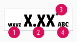|
| Offer | 5. Label   6. Basic pricebox |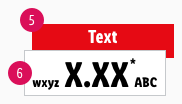|
| Discount | 7. Discount text   8. Recommended Retail Price (rrp) |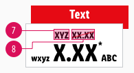|

---

## Overall styling

- The text-style is [pricebox-small](../../General/Typography/Typography.md#pricebox-small) or [pricebox-medium](../../General/Typography/Typography.md#pricebox-medium) for the two possible sizes of the price.
- The text-style is [pricebox-addon](../../General/Typography/Typography.md#pricebox-addon) for asterisk, currency & prefix.
- The line-height is set to **default**.
- Additionally you can choose between a pricebox with or without prefix.

| Types | Attributes | Preview |
|---|---|---|
| Basic | text-color: gray-darker   background-color: basic-white   outline-color: gray-light |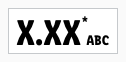 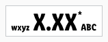|
| Action | text-color: basic-white   background-color: danger-base   outline-color: danger-base |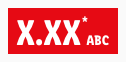 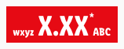 |

## Sizes

- There are two sizes of this component for different purposes.
- For each breakpoint, you can select a corresponding symbol with different price text sizes to suit your layout.

| Size | Usage | Preview |
|---|---|---|
| Small | i.e. product overview | |
| Medium | i.e. product detail page | 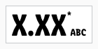|

---

## Label

- The text-style always is [pricebox-addon](../../General/Typography/Typography.md#pricebox-addon).
- The line-height is set to **default**.
- Always use the **base-color** as background-color.
- Combine the standard pricebox with a label to display promotions or discounts.
- Use the label as an add-on for the **offer** pricebox.
- You can advertise discounts, promotions or offers.
- Like the pricebox, you can choose between different label colors.

| Types | Attributes | Preview |
|---|---|---|
| Action | text-color: basic-white   background-color: danger-base |  |
| Offer | text-color: gray-darker   background-color: mark-base | 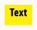 |

---

## Basic quantity

- The text-style always is [small](../../General/Typography/Typography.md#small).
- The line-height is **120%**.
- It's used as additional info for the packaging unit, quantity or drained weight.

| Types | Attributes | Preview |
|---|---|---|
| Basic quantity | text-color: gray-darker | 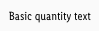 |

---

## Discount

- The text-style always is [pricebox-addon](../../General/Typography/Typography.md#pricebox-addon) for the discount text and the recommended retail pice (rrp).
- The line-height is set to **default**.
- If you want to use a discount, it can be placed in the pricebox **standard** (positive) as well as in the pricebox **offer** (negative) - with or without prefix.
- The strike comes either in **danger-base** or **gray-darker** with a **1px thickness**.
- There is a positive and negative version matching the underlying standard pricebox.

| Types | Attributes | Preview |
|---|---|---|
| Positive | text-color: gray-darker   strike-color: danger-base | 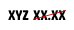 |
| Negative | text-color: basic-white   strike-color: gray-darker |  |

---

## Spacing & Measurements

- The height of the pricebox depends on the content and the additional components shown.
- The width of the pricebox depends on the content.
- The width of the label denpends on the content of the pricebox.
- The height of the label is fixed for a single-line text.
- **Exception!** Designers set the margins to 4px due to a Sketch software problem with different text block widths while **the development uses 2px**.

### Pricebox

| Types | Attributes | Preview |
|---|---|---|
| Vertical spacing | LG: 8px   MD+SM: 8px  XS: 4px |  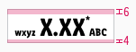 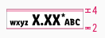 |
| Horizontal spacing | LG: 8px / 4px   MD+SM: 8px / 4px  XS: 4px / 4px | 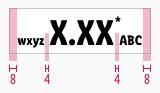 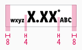 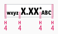 |

### Label

| Types | Attributes | Preview |
|---|---|---|
| Vertical spacing |  LG: 4px / 12px MD+SM: 4px / 12px XS: 2px / 10px | 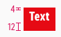 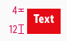 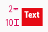 |
| Horizontal spacing | LG: 8px MD+SM: 8px XS: 4px | 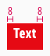 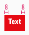 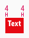 |
| Height | LG: 30px MD+SM: 28px XS: 24px | 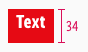 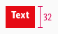 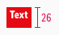 |

### Discount

| Types | Attributes | Preview |
|---|---|---|
| Discount | LG: 8px / 0px MD+SM: 8px / 0px  XS: 4px / 0px | 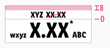 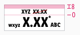 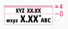 |

---

## Position

### Label

- The pricebox always **overlays the label by 8px**.

| Types | Attributes | Preview |
|---|---|---|
| Offset | LG: 8px   MD+SM: 8px   XS: 4px | 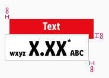 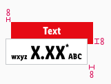 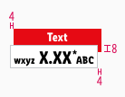 ||

### Basic quantity

- This information always is placed to the **right below the pricebox**.

| Types | Attributes | Preview |
|---|---|---|
| Basic quantity | text and pricebox align right   margin-top: 2px | 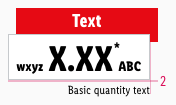 |

---

## Combinations

- There are **different combinations** of priceboxes and labels in the Lidl universe.
- They are called "themes".

| Types | Attributes | Preview |
|---|---|---|
| Offer #1 | label: action   pricebox: standard | 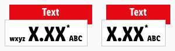 |
| Offer #2 | label: offer   pricebox: standard | 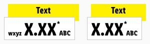 |
| Special offer | label: offer   pricebox: action | 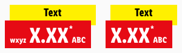 |

---

## Our workflow in Sketch

- Use the "Overrides"-function to change the text.
- Enter the text first. Then adjust the width of the symbol.
- The color variants of the label can be selected in the complete pricebox via the "Overrides"-function.
- The discount has to be added manually as a symbol to the pricebox:
  - First change the height.
  - Second, place the discount in the middle with the corresponding padding.
  - Finally insert the text via the "Overrides"-function.
