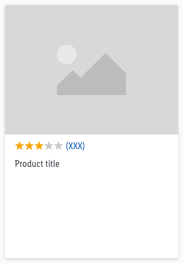

****<AlertInfo alertHeadline="Modifiable">
Please ensure to comply with the corporate identity. What can be modified can be found [here](#what-can-be-modified)
</AlertInfo>

# Rating

The product rating is visually represented with a star rating.

---

## Recommendations

- The maximum number of 5 stars can be reached.
- If the product has not yet been rated, no stars will appear.
- The number in the bracket indicates how many users have already submitted a rating.

---

## Elements

The rating component consists of:

1. Stars
2. Rating number

---

## Overall styling

- The text style is [basic](../../General/Typography/Typography.md#basic).
- The line-height is set to **default**.
- The icon **star-fill** or **star-percentage** is used.

Types | State | Attributes | Preview
---------| ---------|----------|---------
star | default | background-color: gray-light | 
star | hover-focus | background-color: gray-lighter | 
star-selected | default | background-color: mark-darker  | 
star-selected | hover-focus | background-color: mark-dark | 
component with stars | default| star background-color: gray-light  rating number color: brand-primary-base| 
component with stars | hover-focus | star background-color: gray-lighter   rating number color: brand-primary-darker | 
component with stars-selected | default| star background-color: gray-light star-selected background-color: mark-darker  rating number color: brand-primary-base| 
component with stars-selected | hover-focus | star background-color: gray-lighter  star-selected background-color: mark-dark  rating number color brand-primary-darker| 

---

## Spacing & measurements

- The height of the rating is **16px**.
- The width depends on the number of given ratings in the bracket.
- The rating component changes between LG and MD-XS breakpoint. The star icons remain the same size and only the rating number text style changes according to  the [basic text style](../../General/Typography/Typography.md#basic).

| Types | Attributes | Preview |
|---|---|---|
| Icon-size | 16px |  |
| Padding | 4px|  |

---

## Behavior

The inside of the last star item can be filled from left to right based on percentages.
A rating can be interactive (e.g. on product detail page) or static (e.g. on product tile). If the rating is static the rating component has **no hover-focus state**.

---

## Variants

| Rating |  Preview |
|---|---|
| 5 stars ||
| 4 stars ||
| 3 stars ||
| 2 stars ||
| 1 stars ||
| No stars | Not yet rated - no stars are shown. |

---

## Examples

 This is a non-obligatory example of the positioning of the star rating on the product tile.

---

## What can be modified?

- Override the text and select the status of the stars.

### Our workflow in Sketch

- Use the "Overrides"-function to change the number of stars.

---

## References

> [T16 | Global] Rating Stars
