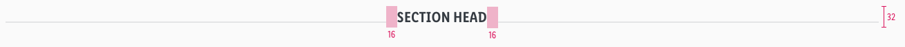

<AlertInfo alertHeadline="Modifiable">
Please ensure to comply with the corporate identity. A detailed list what can be modified can be found [here](#what-can-be-modified).
</AlertInfo>

# Section Head

Use section headlines to structure the page content.

This allows you to structure sections or separate them more clearly from each other.

---

## Recommendation

- **Avoid too long or multiline text.**
- Only a two-line text is allowed as a maximum variant.

---

## Overall styling

- Text style is always [sectionhead](../../General/Typography/Typography.md#sectionhead) and **centered**.
- The line-height is set to **default**.
- Text color is **gray-darker**.
- The lines/dividers color is **gray-lighter** and has a **2px thickness**.
- The width of the left and right line depends on the text length and are scaled completely identically over all stylings.

---

## Spacing & Measurements

| Types | Attributes | Preview |
|---|---|---|
| LG | height: 32px   padding-left /-right: 16px   text-width: 60% | |
| MD-XS | height: 24px   padding-left /-right: 16px   text-width: 60% |  |

---

## What can be modified?

- Adjust the width according to the artboard size.
- Modify the width of text but please stick to the spacing given in the documentation.
- Modify sectionheads to your project needs by changing the colors of the text and the lines (i.e. to basic-white if you want to use the sectionhead on a dark background).

### Our workflow in Sketch

- Unfortunately, the symbol must be detached first to add demo content to a sectionhead.
- Simply adjust the lines/dividers to the distance defined for the text box.
