<AlertInfo alertHeadline="Modifiable">
Please ensure to comply with the corporate identity. A detailed list what can be modified can be found [here](#what-can-be-modified).
</AlertInfo>

# Teaser

Use the teaser component to attract attention and build excitement and expectations through curiosity.

It consists of an image and a text to underline the visual meaning.

---

## Recommendations

- **Always use the text in a single line scenario.**
- If you select a teaser with text, look at it’s contrast to the picture – i.e. choose gray for an image with a bright subject and vice versa.
- Try to keep the 4:3 ratio for teasers to guarantee the right display in each breakpoint.
- Otherwise it’s ratio is completely free adjustable.

---

## Overall styling

- The components has **rounded corners of 2px**.
- It uses the **shadow-default**.

| Types | Gray | White |
|---|---|---|
| title | 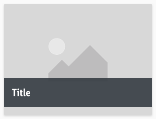 | 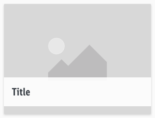 |
| With subhead | 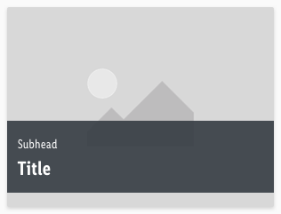  | 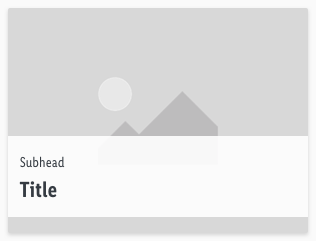 |

### States

- The change of state is mainly shown in the bar and overlay of the image.
- The title gets **underlined** and the image gets an **overlay of basic-white with 50% opacity**.

| States | Gray | White |
|---|---|---|
| Default |  |  |
| Hover / focus | 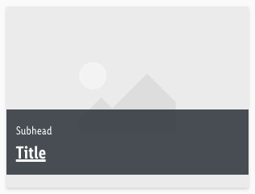  | 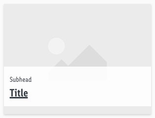 |

### Bars

- The title uses the text-style **large-bold**.
- The subhead comes in the text-style **small**.
- The background-color always has an **opacity of 90%**.

| Types | Attributes | Preview |
|---|---|---|
| Gray | text-color: basic-white background: gray-darker  | 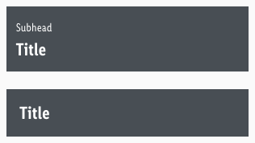 |
| White |  text-color: gray-darker background: basic-white | 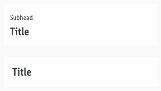 |

---

## Spacing & Measurements

| Types | Attributes | Preview |
|---|---|---|
| Horizontal spacing | padding: 16px | 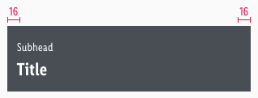 |
| Vertical spacing | padding: 16px distance: 2px | 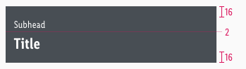 |
| Spacing | margin-bottom: 16px | 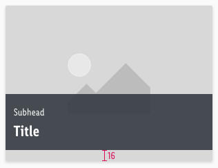 |
| Size | default size of 4:3 | 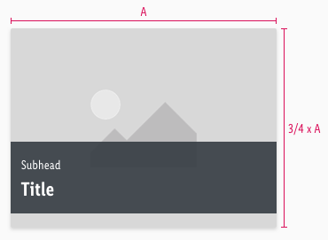 |

---

## What can be modified?

- Override the text and bars.
- Adjust the ratio to any size but please try to stick to a 4:3-ratio.

### Our workflow in Sketch

- Use the "Overrides" function to customize the teaser in the three possible variants (for example, select "None" for the bar element to display just an image teaser).
