<AlertInfo alertHeadline="Modifiable">
Please ensure to comply with the corporate identity. A detailed list what can be modified can be found [here](#what-can-be-modified).
</AlertInfo>

# Theme Slider

The theme slider is a navigation bar for special offers and topics that should be displayed prominently to the user with pictures.

All offers are listed horizontally next to each other. Sliding of offers is a characteristic feature of this components.

---

## Elements

- Item
- Background
- Slider Button

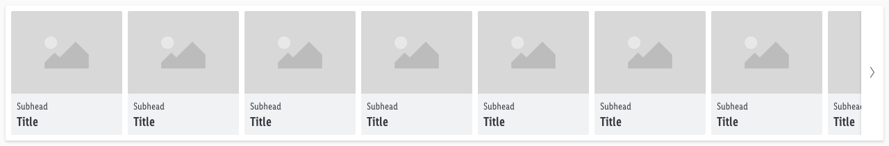

---

## Overall styling

- The background comes in **basic-white**.
- The whole component uses the **shadow-default**.
- The title has the text-style of **basic-bold**.
- The subheadline comes in the text-style **small**.
- The line-height is **120%**.
- The width of the component is **divisible by 8**.
- The image ratio is always **4:3**.
- Every component has **rounded corners of 2px** except the slider button.

### States

- An item is a single navigation element in the theme-slider that is shown with an image and text.
- The behavior of the slider button can be found in the [Slider Button description](Components/Slider%20button/Slider%20button.md).

| Types | Attributes | Preview |
|---|---|---|
| Default | text-color: gray-darker background-color: gray-lightest | 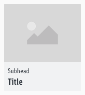 |
| Hover / focus | text-color: gray-darker background-color: gray-lightest **Title gets underlined** **Image has a basic-white overlay with 50% opacity** | 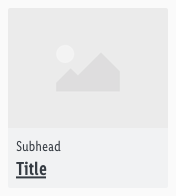 |
| Active | text-color: basic-white background-color: brand-primary-base | 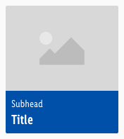 |

---

## Spacing & Measurements

- The total height and width of the component is based on the size of the individual elements and their corresponding spacings.
- The width also depends on how many elements are displayed and is always a multiple of 8.
- The padding and gutter **always is 8px**.
- The slider button always has a width of **32px**.

### Complete

| Type | Attributes | Preview |
|---|---|---|
| LG | width: 1264px | 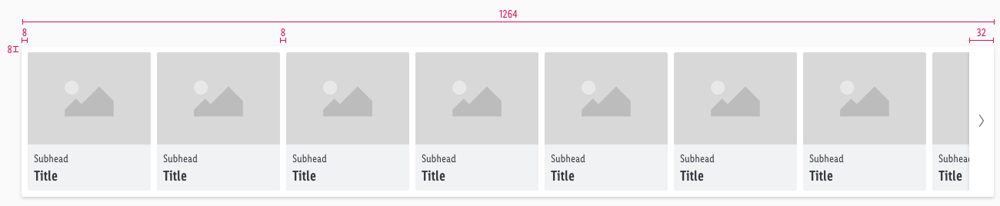 |
| MD+SM | width: 944px (MD) width: 584px (SM) | 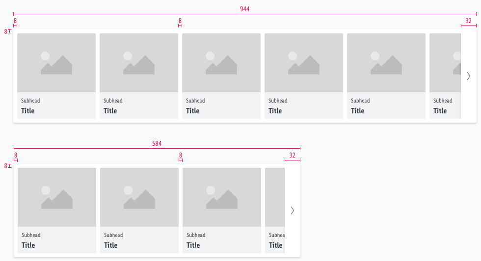 |
| XS | width: 304px |  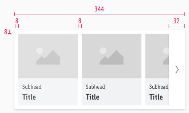 |

### Item

| Type | Attributes | Preview |
|---|---|---|
| Horizontal spacing | padding: 8px | 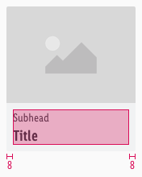 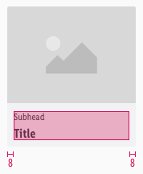 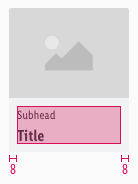 |
| Vertical spacing | padding: 8px margin: 4px |  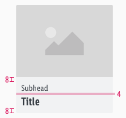 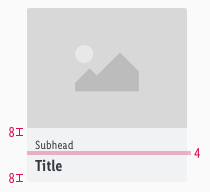 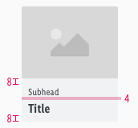 |
| Width | LG: 160px MD+SM: 160px XS: 120px | 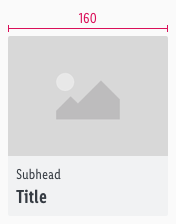 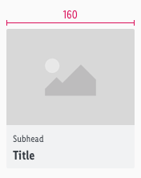 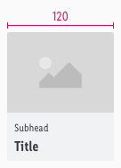|

---

## What can be modified?

- Override text and image.
- Modify theme sliders to your project needs by deleting single symbols (i.e. like the tab or slider button symbol)
- Modify theme sliders to your project needs by shortening the complete symbol but please stick to the rule of 8 (i.e. theme slider with 6 items to a width of 1016px in LG).

### Our workflow in Sketch

- Use the "Overrides"-function to customize the theme slider in the three possible variants or to change the titles or sub-headlines.
- Use the "Overrides"-function to hide the slider buttons when they are not needed.
