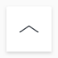
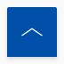
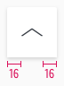
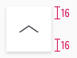
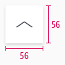
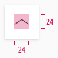

<AlertInfo alertHeadline="Modifiable">
Please ensure to comply with the corporate identity. A detailed list what can be modified can be found [here](#what-can-be-modified).
</AlertInfo>

# To Top

Use this "button" to allow the customer to jump directly to the top of the page.

It is a sticky element that floats outside the layout.

---

## Overall styling

- The component has a rounded upper left and right corner of 2px.
- It uses the shadow-default.

| Types | Attributes | Preview |
|---|---|---|
| Default | background-color: basic-white icon-color: gray-darker |  |
| Hover / focus | background-color: brand-primary-base icon-color: basic-white |  |

---

## Recommendations

- Extend the footer by 64px to provide enough space for the to-top-button at the end of a website (so elements will not be overlapped).

---

## Spacing & measurements

| Types | Attributes | Preview |
|---|---|---|
| Horizontal spacing | padding: 16px |  |
| Vertical spacing | padding: 16px |  |
| Size | fixed to 56x56px |  |
| Icon size | 24x24px |  |

---

## What can be modified?

- Modify to-top buttons to your project needs by changing the icons, shape or color.
