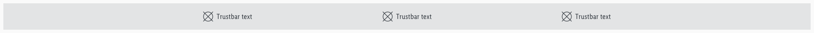
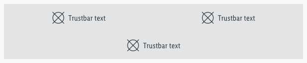
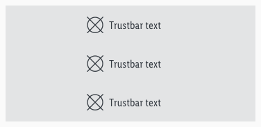

<AlertInfo alertHeadline="Modifiable">
Please ensure to comply with the corporate identity. A detailed list what can be modified can be found [here](#what-can-be-modified).
</AlertInfo>

# Trustbar

The trustbar is a possibility to show unique selling propositions, services or other outstanding benefits of the company. The standard position on a website is right above the footer.

---

## Recommendations

- Use only one word or a short single line of text.
- There is no multiline.
- Please ensure that the content meets this requirement.

---

## Overall styling

- The text-style is **basic**.
- The background-color always is **gray-lighter**.
- Default states icon- and text-color is **gray-darker**.
- The hover, focus and active state is also shown in gray-darker but the **mouse cursor changes into a link cursor (pointer)**.
- The icon and text are **aligned horizontally and vertically to the center**.

---

## Spacing & Measurements

| Types | Attributes | Preview |
|---|---|---|
| Height | LG: 64px   MD-XS: 56px |     |
| Icon-size | 24x24px |  |
| Horizontal spacing | margin: 8px |  |
| Horizontal spacing   content and elements | padding-left and -right: 8px   padding: 16px|  |

---

## Variants

- The width depends on the number of elements but always matches our grid.
- The width of the single trustbar elements adapts to grid.
- The trustbar extends over the entire screen width.
- In the LG Breakpoint the elements are placed in the content area, the background extends over the whole screen width.
- The minimum version consists of 3, the maximum version of 4 trustbar elements.

| Breakpoints | 3-items | 4-items |
|---|---|---|
| LG |||
| MD |||
| SM |||
| XS |||

---

## What can be modified?

- Override the text and icons.
- Change the arrangement of the symbols.
- Change the number of single items but please try to stick to the grid (i.e. 6 USPs instead of 4).

### Our workflow in Sketch

- Change the text or icon by using the "Overrides"-function.
