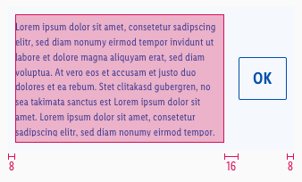
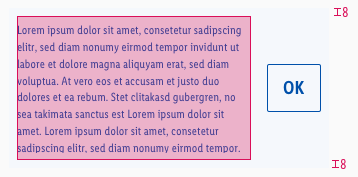

<AlertInfo alertHeadline="Modifiable">
Please ensure to comply with the corporate identity. A detailed list what can be modified can be found [here](#what-can-be-modified).
</AlertInfo>

# Cookie Alert

Visitors of websites have to be informed about the legal requirements or privacy policy.

---

## Recommendations

- Keep the cookie text as short as possible.
- Offer the user a clear description of the button labels in order to select the cookie settings.

---

## Overall styling

- Text-style is **small**.
- Text-color is **brand-primary-base**.
- Background-color is **brand-primary-background**.
- The button comes in the **positive-secondary** style.
- The height depends on the content and the additional components shown.
- The button is horizontally centered.

---

## Position

| LG & MD | SM & XS |
|---|---|---|---|
| <ul><li>The cookie alert is placed on top of the website.</li><li> Always over the header in desktop and tablet landscape mode.</li></ul> | <ul><li>The cookie alarm is displayed at the bottom of the screen.</li><li>The content can still be scrolled when the alert is visible.</li></ul> |

---

## Spacing & Measurements

| Types | Attributes | Preview |
|---|---|---|
| Horizontal spacing | padding: 8px margin: 16px |  |
| Vertical spacing | padding: 8px |  |

---

## What can be modified?

- Override the text.

### Our workflow in Sketch

- Use the „Overrides“-function to edit the content.
