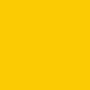

<AlertWarning alertHeadline="Not modifiable">
It is mandatory to maintain the appearance and behavior of these components.
</AlertWarning>

# Colors

Colors help to emphasize and highlight your brand's appearance.

---

## Color concept

- Our color concept is a result of our accessibility problems.
- In developing this concept, we focused on **simplicity**, **clarity**, **adaptation** and **portability to the frontend**.

### Create a scale

- The scale has a total of **8 levels**, using the lowest level always as a background color.
- It’s principally based on a **base** color as a reference.
- The basic color becomes either lighter (light, lighter, lightest) or darker (dark, darker, darkest) in the standard 3 steps.
- The **lightest** and **darkest** levels can be disregarded in relation to brand or theme colors, as well as additional colors, thanks to their low contrast with already existing colors (i.e. background or black).
- The **dark** and **darkest** levels of gray can also be disregarded due to no usage in our design system.

| Name | Values | e.g. Gray | Accessibility (on gray-background) |
|---|---|---|
| background | base +96% white |  | - |
| lightest | base +92% white |  |  |
| lighter | base +84% white |  |  |
| light | base +68% white |  |  |
| base | - |  |  |
| dark | base +16% black |  |  |
| darker | base +32% black |  | |
| darkest | base +64% black |  |   |

---

## Brand Colors

- The Lidl brand colors communicate the personality of the brand.
- Lidl blue, red and yellow - the contrasting primary colors symbolize **responsibility**, **dynamism** and **vitality**.
- In combination, they appear versatile and unexpected.

### Brand-primary (Lidl blue)

- It seems interactive.
- The base color is used for icons & links, to symbolize activeness, to show possible selection or highlights or different conditions.
- The brand-primary color can be changed according to the desired project color (example: wine).

| Name | Values | Concept | Color |
|---|---|---|---|
| base | HEX: #0050AA RGB: 0 / 80 / 170 | - |  |
| background | HEX: #F5F8FC RGB: 245 / 248 / 252 | base +96% white |  |
| lighter | HEX: #D6E3F1 RGB: 214 / 227 / 241 | base +84% white |  |
| light | HEX: #ADC7E4 RGB: 173 / 199 / 228 | base +68% white |  |
| dark | HEX: #00438F RGB: 0 / 67 / 143 | base +16% black |  |
| darker | HEX: #003673 RGB: 0 / 54 / 115 | base +32% black |  |

### Danger (Lidl red)

- It stands for danger and shows an error or a malfunction.
- In the digital environment, red is only used to a reduced extent as an additional color.
- The base color should also work as a indicator for pricing.

| Name | Values | Concept | Color |
|---|---|---|---|
| base | HEX: #E60A14 RGB: 230 / 10 / 20 | - |  |
| background | HEX: #FEF5F6 RGB: 254 / 245 / 246 | base +96% white |  |
| lighter | HEX: #FBD8D9 RGB: 251 / 216 / 217 | base +84% white |  |
| light | HEX: #F7B0B3 RGB: 247 / 176 / 179 | base +68% white |  |
| dark | HEX: #C10811 RGB: 193 / 8 / 17 | base +16% black |  |
| darker | HEX: #9C080E RGB: 156 / 8 / 14 | base +32% black |  |

### Mark (Lidl yellow)

- It isn't used very often.
- It offers a low contrast ratio to a light background in the digital department.
- It's mostly used in pricing.
- To match the definition of the Lidl colors, yellow must be overlaid with Lidl red for the darker colors.

| Name | Values | Concept | Color |
|---|---|---|---|
| base | HEX: #FFF000 RGB: 255 / 240 / 0 | - |  |
| background | HEX: #FFFEF5 RGB: 255 / 254 / 245 | base +96% white |  |
| lighter | HEX: #FFFDD6 RGB: 253 / 253 / 214 | base +84% white |  |
| light | HEX: #FFFAAD RGB: 255 / 250 / 173 | base +68% white |  |
| dark | HEX: #FBCB03 RGB: 251 / 203 / 3 | base +16% Lidl red |  |
| darker | HEX: #F7A606 RGB: 247 / 166 / 6 | base +32% Lidl red |  |

---

## Additional colors

- These colors are associated with certain meanings and are used for different states/type of messages, sales elements & action notes (badges, ribbons, offers, …) and priceboxes.

### Info

- The info color corresponds to the blue of our brand-primary.
- You will find info in **alerts**, **badges**, **ribbons** or **pricebox highlight labels**.

| Name | Values | Concept | Color |
|---|---|---|---|
| base | HEX: #0050AA RGB: 0 / 80 / 170 | - |  |
| background | HEX: #F5F8FC RGB: 245 / 248 / 252 | base +96% white |  |
| lighter | HEX: #D6E3F1 RGB: 214 / 227 / 241 | base +84% white |  |
| light | HEX: #ADC7E4 RGB: 173 / 199 / 228 | base +68% white |  |
| dark | HEX: #00438F RGB: 0 / 67 / 143 | base +16% black |  |
| darker | HEX: #003673 RGB: 0 / 54 / 115 | base +32% black |  |

### Success

- In our case this color scheme indicates success.

| Name | Values | Concept | Color |
|---|---|---|
| base | HEX: #348553 RGB: 52 / 133 / 83 | - |  |
| background | HEX: #F7FAF8 RGB: 247 / 250 / 248 | base +96% white |  |
| lighter | HEX: #DEEBE3 RGB: 222 / 235 / 227 | base +84% white |  |
| light | HEX: #BED8C8 RGB: 190 / 216 / 200 | base +68% white |  |
| dark | HEX: #2C7046 RGB: 44 / 112 / 70 | base +16% black |  |
| darker | HEX: #235A38 RGB:35 / 90 / 56 | base +32% black |  |

### Warning

- This color scheme has the meaning of activity, change and impact.
- In particular, it should generate attention.

| Name | Values | Concept | Color |
|---|---|---|---|
| base | HEX: #BE591D RGB: 190 / 89 / 29 | - |  |
| background | HEX: #FCF8F6 RGB: 252 / 248 / 246 | base +96% white |  |
| lighter | HEX: #F5E4DB RGB: 245 / 228 / 219 | base +84% white |  |
| light | HEX: #EACAB6 RGB: 234 / 202 / 182 | base +68% white |  |
| dark | HEX: #9F4B18 RGB: 159 / 75 / 24 | base +16% black |  |
| darker | HEX: #813C14 RGB: 129 / 60 / 20 | base +32% black |  |

---

## Grayscale

- It is used to display the status and character of messages.
- Especially the grayscale stands for different states.
- The lightest shade of gray (background) is mainly reserved for the website background.
- Our basic font-color always gray-darker.

| Name | Values | Concept | Color |
|---|---|---|---|
| base | HEX: #4E5761 RGB: 78 / 87 / 97 | - |  |
| background | HEX: #FAFAFA RGB: 250 / 250 / 250 | base +96% white |  |
| lightest | HEX: #F1F2F3 RGB: 241 / 242 / 243 | base +92% white |  |
| lighter | HEX: #E3E4E5 RGB: 227 / 228 / 229 | base +84% white |  |
| light | HEX: #C6C9CC RGB: 198 / 201 / 204 | base +68% white |  |
| darker | HEX: #353B42 RGB: 53 / 59 / 66 | base +32% black |  |

---

## Theme Colors

- The brand-primary color can be changed according to the desired project color.

### Wine

- The wine theme e.g. uses burgundy instead of blue as it's brand-primary color.
- Use this shades of red if you are designing or layouting a Lidl wine theme.

| Name | Values | Concept | Color |
|---|---|---|---|
| base | HEX: #B0082B RGB: 176 / 8 / 43 | - |  |
| background | HEX: #FCF5F7 RGB: 252 / 245 / 247 | base +96% white |  |
| lighter | HEX: #F2D7DD RGB: 242 / 215 / 221 | base +84% white |  |
| light | HEX: #E6B0BB RGB: 230 / 176 / 187 | base +68% white |  |
| dark | HEX: #940724 RGB: 148 / 7 / 36 | base +16% black |  |
| darker | HEX: #77051A RGB: 119 / 5 / 29 | base +32% black |  |

---

## Basic

- Colors for highest contrast.

| Name | Values | Color |
|---|---|---|
| white | HEX: #FFFFFF RGB: 255 / 255 / 255 |  |
| black | HEX: #000000 RGB: 0 / 0 / 0 |  |

---

## Gradients

- Gradients in the primary colors Lidl blue, red and yellow strengthen the brand personality and create value.
- By aligning light to dark, they also emphasize dynamism and modernity.
- They underline the optical character of a basic color and create a pleasant haptic feeling and a spatial impression.
- Gradients should only be used for background areas.

| Values | Brand-primary | Danger | Mark | Info | Success | Warning | Gray | Wine |
|---|---|---|
| **0%** **base** e.g. danger-base  **60%** **base** e.g. danger-base  **100%** **darker** e.g. danger-darker |  |  |  |  |  |  |  |  |

---

### Workflow in Sketch

- A color is the smallest ingredient in the library. It is integrated as a symbol in many other ingredients, doughs and pieces.
- If you want to change the color or turn it off, look into its symbols „Overrides“-function.
