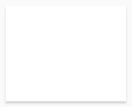
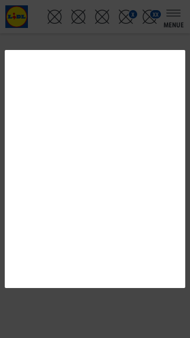
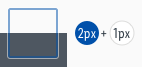
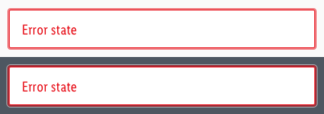

<AlertWarning alertHeadline="Not modifiable">
It is mandatory to maintain the appearance and behavior of these components.
</AlertWarning>

# Effects

Effects can be used to highlight individual elements.

Shadows visualize a spatial impression. They mark elements from their environment. They can also be used to display interactivity.

Overlays emphasize the contents above it and further hide not relevant information.

The browser focus shows the element what is currently focused.

---

## Usage

- Mainly the effects are used for picture-text compositions. But it can also be used as a highlight element.

---

## Shadows

### Default

- This shadow should be used for all elements that are displayed with a better recognition in contrast to the website background.

| Attributes | Preview |
|---|---|
| HEX: #000000 rgba: 0, 0, 0, 0.15 settings: 0px 2px 4px 0px |  |

### Flyout

- This shadow can only be used with superimposed elements.
- They create a spatial effect  which clearly overlay the page, e.g. layers, lightboxes, flyouts.

| Attributes | Preview |
|---|---|
| HEX: #000000 rgba: 0, 0, 0, 0.15 settings: 0px 3px 3px 0px |  |

---

## Overlays

- This overlay covers the website in the background and highlights important content.
- The overlay **extends across the entire page**.
- The content box placed over the overlay can have a **free ratio**.
- The content box should have rounded corners with **2px radius**.

| Attributes | Preview |
|---|---|
| color: basic-black   opacity: 72% |  |

---

## Browser focus

- The browser focus shows the element what is currently focused.
- Use the given focus for a consistent experience.

| Attributes | Preview |
|---|---|
| color: brand-primary base   opacity: 50%   outline (outside): 3px   radius: 2px |  |
| **Exception!**   The error state has the   color: danger-base |  |
