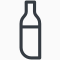
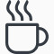
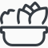
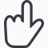
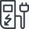

<AlertWarning alertHeadline="Not modifiable">
It is mandatory to maintain the appearance and behavior of these components.
</AlertWarning>

# Icons

Icons are  an essential element of design and are also known as pictograms. They can stand individually, be displayed together, or be part of an element.

They support the understanding of an information or function. Symbols are easier to read than text. They are mainly used to identify a function. It can also be used as an infographic or illustration.

---

## General

- The appearance of the icon depends on the usage or context.
- There’s also a **positive** and **negative** version to layout on a light or dark background.
- Icons have an original size of **60x60px**.
- The size has to follow the **rule of 8** (8, 16, 24, 32, …).

---

## Usage

- Icons can be used for **status**, as **links**, as **navigation**,  to **support** another element (in alerts, buttons, input-fields, etc.) or as  **illustration**.

### Styling as link

- Icons with a link have the same styling as text-links – on light as well as dark background.

| States | Attributes | Image |
|---|---|---|
| default | icon-color: brand-primary-base |  |
| hover / focus | icon-color: brand-primary-darker |  |
| disabled | icon-color: brand-primary-light |  |

### Styling as status

- Informs about a changed status, for example the current items in the shopping cart.
- The number of items can be displayed by addons.

| States | Attributes | Image |
|---|---|---|
| default | icon-color: gray-darker  |  |
| hover / focus | icon-color: brand-primary-base |  |
| active | icon-color: brand-primary-base **but the icon gets "…-solid"** |  |
| disabled | icon-color: brand-primary-light |  |

### Styling as navigation

- Icons that specify a direction.
- Icons symbolizing the current location.

| States | Attributes | Image |
|---|---|---|
| default / active | icon-color: gray-darker  |  |
| hover / focus | icon-color: brand-primary-base |  |
| disabled | icon-color: gray-light |  |

---

## Animal

- Icons representing animals.

| Name | Icon | Purpose |
|---|---|---|
| cattle |  | cow, beef |
| chicken |  |  |
| crab |  | seafood |
| deer |  | venison  |
| dog |  |  |
| fish |  | seafood |
| goose |  |  |
| pig |  | pork |
| rabbit |  | bunny, easter |
| shrimp |  | seafood |
| turkey |  | |

---

## Expression

- Icons symbolize a special expression, e.g. message about incorrect input or correct input, legal information, etc.
- Icons that support textual information visually.

| Name | Icon | Purpose |
|---|---|---|
| award |  | quality |
| certificate |  | diploma, license |
| comment |  | speech bubble, text |
| conversation-ballons |  | feedback |
| conversation-ballons-chat |  | chat |
| dice-percentage |  | competition, gambling |
| exclamation-ballon |  | statement, answer |
| exclamation-circle |  | attention |
| exclamation-triangle |  | danger |
| gift-close |  | present |
| gift-open |  | surprise |
| handshake |  | collaboration, cooperation, support |
| hook-circle |  | check, ok, success |
| hook-shield |  | security, shield |
| hook-square |  | checkbox |
| information-circle |  | information |
| lightbulb-off |  | light off, bulb, turned off |
| lightbulb-on |  | idea, light on, bulb, note, tip |
| newspaper |  | news |
| paragraph-circle |  | imprint, legal, disclaimer |
| piggy-bank |  | save money, cash, savings |
| questionmark-ballon |  | question |
| questionmark-circle |  |   |
| stop-sign |  | stop  |
| thumbs-up-ballon |  | feedback, social media |

---

## Food & beverage

- Icons that can be associated with food and beverages.

| Name | Icon | Purpose |
|---|---|---|
| apple |  |  |
| bakery-products |  |  |
| barrel |  | maturity (wine) |
| beer-glass |  | beer |
| bottle |  | single glass bottle |
| bottles |  | storage (wine) |
| bread |  | bake, bakery |
| bun |  |  |
| cheese-1 |  |  |
| cheese-2 |  | mild cheese (wine) |
| chefs-hat |  | cook, cooking, recipe |
| chocolate-bar |  |  |
| cupcake |  | dessert (wine) |
| cutlery-plate |  | goes well with… (wine) |
| different-bottles |  | quantity (wine) |
| food-1 |  |  |
| food-2 |  |  |
| glass-bottle-percentage |  | alcohol content (wine)  |
| grapes |  |  |
| grill |  | barbecue (wine) |
| mug-hot |  | coffee, tea, hot drinks  |
| olive-cheese |  | aperitif (wine), appetizer (wine), canapé (wine) |
| piece-of-cake |  | a piece of cake |
| pretzel |  |  |
| salad-bowl |  | salad |
| salami |  |  |
| shell |  | clam (wine), mussel (wine) |
| steak |  | meat |
| vegetables |  |  |
| wine-glas-1 |  |  |
| wine-glas-2 |  | taste (wine) |
| wine-glasses |  | color (wine) |

---

## Interaction

- These icons are used for interactions.
- The user remains in the current position and the icon triggers an action.
- The icon offers the user a function, action or position.

| Name | Icon | Purpose |
|---|---|---|
| 360-degree |  |  |
| arrow-left-circle |  | back |
| arrow-right-circle |  | next |
| arrows-expand |  | enlarge, full screen |
| arrows-vertical |  | sort |
| bars-horizontal |  | menu |
| book-open |  | read, literature |
| bulletlist |  |  |
| calendar-clock |  | appointment, schedule |
| calendar |  | date, appointment |
| camera |  | photo |
| checklist |  |  |
| clip |  | attachment |
| clock |  | time |
| cogwheel |  | settings |
| controls |  | settings, slider |
| crosshair |  | locate |
| download |  | save |
| ellipsis-horizontal |  | more |
| envelope-close |  | address |
| envelope-open |  | newsletter |
| external-link |  | new window, link out, external link  |
| eye-close |  | hide |
| eye-open |  | show |
| file |  | paper |
| fingerprint |  | identity |
| flyer |  | leaflets |
| hand-pointer |  |  |
| hook |  | check, ok |
| house |  | home |
| invoice |  | paper, notes, bill, receipt, document |
| lock-close |  | security, secure |
| lock-open |  | insecure |
| magnifier-plus |  | zoom in |
| magnifier-minus |  | zoom out |
| magnifier |  | zoom |
| map-marker |  | location |
| map |  |  |
| microphone-on |  | voice |
| minus |  | less |
| paper-plane |  | send, submit, post |
| pause-circle |  | pause |
| pencil |  | edit |
| phone-envelope |  | contact |
| phone |  | call |
| placeholder |  |  |
| play-circle |  | play |
| plus |  | more |
| printer |  | print |
| share |  | upload |
| shopping-bag |  |  |
| shopping-cart-1 |  |  |
| shopping-cart-2 |  | express |
| social-share |  |  |
| square |  | grid |
| store |  |  |
| store-magnifier |  | search store |
| sync |  | refresh, rotate |
| trash |  | delete |
| upload |  |  |
| user-eighteen-plus |  | adults only |
| user |  | account, profile |
| volume-up |  |  |

---

## Nature

- Icons that can be associated with nature.

| Name | Icon | Purpose |
|---|---|---|
| cloud |  |  |
| earth-map-marker |  | region (wine) |
| earth |  |  |
| ecology |  | sustainable |
| ecology-2 |  | world, care, earth |
| heartbeat |  | health, pulse |
| leaf |  |  |
| snowflake |  | ice, snow, frost, freeze, cold |
| sun |  | hot, summer |
| thermometer |  | temperature (wine) |

---

## Navigation

- These icons are used for navigation – the user is redirected from the current position.

| Name | Icon | Purpose |
|---|---|---|
| arrow-down |  | down, expand |
| arrow-left |  | left, back |
| arrow-right |  | right, forward |
| arrow-up |  | up, collapse |
| cross |  | close, quit, abort |
| undo |  |  |

---

## Payment

- Icons associated with money or payment methods.

| Name | Icon | Purpose |
|---|---|---|
| contactless-payment |  |  |
| credit-card |  | electronic cash |
| money-return |  |  |
| money |  | salary, wage |
| voucher-euro |  | voucher, bond |
| voucher-gift |  | gift, voucher |
| voucher-percentage |  |  |
| wallet-coins |  |  |

---

## Smiley

- Smileys can be used to display ratings or to ask for user feedback.

| Name | Icon | Purpose |
|---|---|---|
| bad |  |  |
| best |  | happy, awesome |
| better |  | smile |
| good |  | glad |
| neutral |  |  |
| worst |  | sad |

---

## Status

- Icons that can change their appearance after an activation of the user (e.g. add to wishlist, like, set reminder).
- **Only these icons** switch from the **regular** outline look to a **solid** look when active.

| Name | Icon | Purpose |
|---|---|---|
| bell-regular |  | alarm, reminder |
| bell-solid |  | alarm, reminder |
| bookmark-regular |  | chapter |
| bookmark-solid |  | chapter |
| heart-regular |  | favorite, watchlist |
| heart-solid |  | favorite, watchlist |
| star-regular |  | favorite |
| star-solid |  | favorite |
| thumbs-up-regular |  | like, feedback |
| thumbs-up-solid |  | like, feedback |
| thumbs-down-regular |  | dislike |
| thumbs-down-solid |  | dislike |

---

## Technology

- Icons that deal with the topic of technology.

| Name | Icon | Purpose |
|---|---|---|
| computer-mouse |  | software |
| display-play |  | video |
| display |  | screen |
| e-charging-station|  | mobility, charging, e-station |
| keyboard|  | hardware, typing|
| power|  | plug, electric |
| smartphone |  | mobile |
| wifi |  |  |

---

## Transport & logistic

- These icons can be used to symbolize mobility, transport or logistics.

| Name | Icon | Purpose |
|---|---|---|
| bicycle |  |  |
| ♥ box |  | package, delivery |
| box-coins-return |  | money back  |
| box-multiple|  | send multiple packages |
| box-open |  |  |
| box-return |  | right of return |
| box-return-30-days |  |  |
| box-return-90-days |  |  |
| car |  |  |
| express-delivery |  |  |
| packstation |  |  |
| plane |  | travel |
| truck |  | delivery |

---

## More icons

- The LIDL universe contains plenty of other icons that are not available in our design system and frontend framework.
- The naming of SVG files also differs from the LIDL standard because of the general usage of icons in our product.
- For more icons and further details log on to [brand.lidl](https://www.brand.lidl/site/login)
