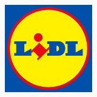
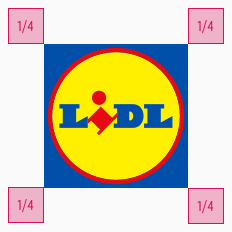

<AlertWarning alertHeadline="Not modifiable">
It is mandatory to maintain the appearance and behavior of these components.
</AlertWarning>

# Logo

The logo gives a visual representation of your company brand.

---

## General

- The LIDL logo has a great recognition value and serves as a foundation for the visual identity of our brand.
- The combination of clear forms and strong colors symbolize strength, diversity and price competitiveness.
- The logo is unchangeable.
- The color highlighting and the slanted position of the "i" in the lettering emphasize the fresh and surprising character of LIDL.

---

## Logo RGB

- The logo is the most important recognition element of the LIDL brand.

## Protection Zone

- In order to guarantee the integrity of the LIDL logo, we establish a protective zone that is free of visual disturbances and distractions
- No other graphic or typographic elements should be placed in this protection zone
- Even image elements in the background should be reassured
- The protection zone is 1/4 of the logo width 

