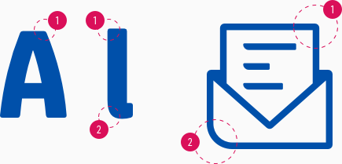

<AlertWarning alertHeadline="Not modifiable">
It is mandatory to maintain the appearance and behavior of these components.
</AlertWarning>

# Radius

Matching the corporate identity, the different radii generally always describe a formal language. They are derived from the typeface and icons to create a harmonious overall picture to the customer.

---

## Concept

1. Default corners with a 2px rounding
2. Special corners with a 10px rounding

---

## Usage

- Use the default corners for almost all elements. For example buttons, form fields, product tile, etc.
- Use the special corners sparingly for highlight elements. If the default corners don't stand out enough for the needs of your project.

---

## General

- These 3 different radii can be found in various components implemented in our products.

| Values | Preview |
|---|---|
| 0px |  |
| 2px |  |
| 10px |  |
