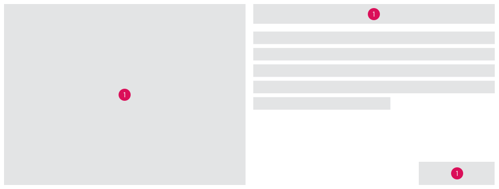

<AlertWarning alertHeadline="Not modifiable">
It is mandatory to maintain the appearance and behavior of these components.
</AlertWarning>

# Skeleton

Skeleton screens use a stylized UI to indicate to users that a content is still loading and that they have to wait. The step by step rendering of the loading content conveys a passage of time and in that way ensures a better user experience.

---

## Recommendation

- Skeleton loaders should be used when pages or sections can be progressively populated with content, such as text and images, as they become available.
- Content should immediately replace each skeleton loader when it is available.
- Instantly loading content does not need a skeleton loader.
- Skeleton screens should not be used as splash screens.
- Motion effects are recommended to decrease the preceived duration time.
- A skeleton screen should not be used in combination with a spinner.

---

## Overall styling

1. **Shapes** - Simple shapes without rounded edges represent different content types like text and images and they follow the [spacing guidelines](../../Getting%20started/Spacing/Spacing.md#).

Attributes | Preview |
---------|----------|
shimmer effect from left to right  layer 1: basic-white gradient\* layer 2: gray-lighter  \*horizontal gradient value: 0% basic-white / 100% basic-white / 0% basic-white |  |
pulse effect with fading in and out gray-lighter | 

### Motion

1. **Basic pulse motion:** Shapes filled in gray-lighter have a fade-in and fade-out pulsing motion to indicate that they are being loaded.
2. **Shimmer effect motion:** A two layered, filled shape where the gradient moves from left to right with a slow motion speed and where its animation has a constant duration time.

---

## Implementation of skeleton screen

Prioritize what type of loading content should be simulated with skeleton loaders.

---

## References

> UID-826 // Skeleton for our gridbox (web) 
[uxdesign.cc - What you should know about skeleton screens](https://uxdesign.cc/what-you-should-know-about-skeleton-screens-a820c45a571a) 
[medium.com - Engaging users with progressive loading in skeleton screen](https://medium.com/uxd-talks/engaging-users-with-progressive-loading-in-skeleton-screen-335a4e287a55)
