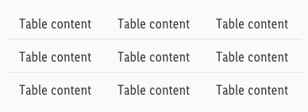
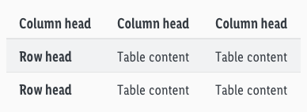
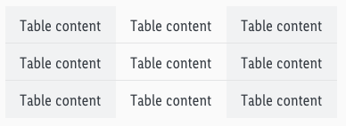
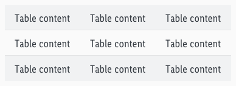
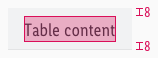
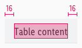

<AlertWarning alertHeadline="Not modifiable">
It is mandatory to maintain the appearance and behavior of these components.
</AlertWarning>

# Tables

Tables are texts in several columns and rows.

In our case, only rows are separated by a horizontal divider. The use of background colors is an additional distinction.

---

## Overall styling

- The text-style is **basic** or **basic-bold** for headlines.
- The font-color is **gray-darker**.
- Normal dividers have **gray-lighter** as color and a **1px thickness**.
- Column header dividers also have gray-lighter as color but a **2px thickness**.
- The background-color for a table with background **always is gray-lightest**.

---

## General

There are different kinds of tables.

### Simple table

- Just a simple table with no special styling or layout.

### Table with headers

- Column-head differs visually in text-style and divider.
- Row-head differs visually in text-style.

### Table with vertical background

- The background color changes in every odd column (e.g. 1, 3, 5, 7,…).

### Table with horizontal background

- The background color changes in every odd row (e.g. 1, 3, 5, 7,…).

---

## Special behaviour

- The table can be scrolled **vertically** and **horizontally** for tables that are wider than the viewport.
- A **zoom function** can be added for smaller devices.
- The font size depends on the size of the body text.
- In some cases, a different font size can be used.

---

## Spacing & measurements

| Type | Attributes | Preview |
|---|---|---|
| Vertical spacing (for column head, row head & table content) | padding-top: 8px padding-bottom: 8px |  |
| Horizontal spacing (for column head, row head & table content) | padding-left: 16px padding-right: 16px |  |

---

## Our workflow in Sketch

- There are symbols in our library to layout tables.
- Each table must be created independently.
- The different „Overrides“-functions help here.
