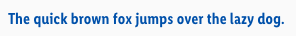
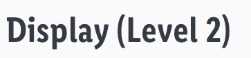
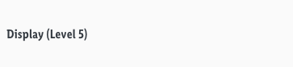
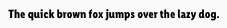

<AlertWarning alertHeadline="Not modifiable">
It is mandatory to maintain the appearance and behavior of these components.
</AlertWarning>

# Typography

The LIDL Font was developed for the various topics and applications of LIDL's brand communication and represents the brand values and the brand core on a typographical level.

It helps you to present your design and content as clearly and effectively as possible according to the LIDL standard.

---

## LIDL Font Condensed Pro

- It looks **informative**, **useful** and **efficient**.
- In combination, they represent the variety of topics and actions and, at the same time, are **100% LIDL**.
- Use any base color of **brand-primary**, **danger**, **success**, **info** or **warning** as text color as long as it has a high contrast ratio in interaction with backgrounds.

> - All types of headings should primarily be used in **single line scenarios**.
> - **Capital letters are not allowed**. The **only exceptions** are sections heads and buttons.

 
 
 

| Typeface | Text-style | Usage |
|---|---|---|
| Regular | Small, Basic, Large | for body text, links, tables, lists, input-fields, etc. |
| Semibold | Small Bold, Basic Bold, Large Bold, Headlines, Displays, Section head, Brand claim, Button text | for headlines, labels, highlights, etc. |
| Bold | Pricebox addon, Pricebox small, Pricebox medium | mainly used for priceboxes and their addons |

---

## Small

- The typeface is always **regular**.
- The line-height is **140%**.
- Left, center, and right alignment are available for this font style.

| Breakpoint | Font size | Preview |
|---|---|---|
| LG | 14px |  |
| MD-XS | 12px |  |

## Small bold

- The typeface is always **semibold**.
- The line-height is **140%**.
- Left, center, and right alignment are available for this font style.

| Breakpoint | Font size | Preview |
|---|---|---|
| LG | 14px |  |
| MD-XS | 12px |  |

---

## Basic

- The typeface is always **regular**.
- The line-height is **140%**.
- Left, center, and right alignment are available for this font style.

| Breakpoint | Font size | Preview |
|---|---|---|
| LG | 18px |  |
| MD-XS | 16px |  |

## Basic bold

- The typeface is always **semibold**.
- The line-height is **140%**.
- Left, center, and right alignment are available for this font style.

| Breakpoint | Font size | Preview |
|---|---|---|
| LG | 18px |  |
| MD-XS | 16px |  |

---

## Large

- The typeface is always **regular**.
- The line-height is **140%**.
- Left, center, and right alignment are available for this font style.

| Breakpoint | Font size | Preview |
|---|---|---|
| LG | 22px | |
| MD-XS | 20px |  |

## Large bold

- The typeface is always **semibold**.
- The line-height is **140%**.
- Left, center, and right alignment are available for this font style.

| Breakpoint | Font size | Preview |
|---|---|---|
| LG | 22px |  |
| MD-XS | 20px |  |

---

## Brand claim

- Brand Claim is the company's customer approach.
- It is positioned next to the LIDL logo in the header component.
- The typeface is always **semibold**.
- It is always shown in **brand-primary-base**.
- The line-height is **120%**.

| Breakpoint | Font size | Preview |
|---|---|---|---|
| LG | 18px |  |
| MD-XS | 16px |  |

---

## Button text

- The text-style is only used in our button component.
- The typeface is always **semibold**.
- The line-height is **120%**.

| Breakpoint | Font size | Preview |
|---|---|---|---|
| LG | 18px |  |
| MD-XS | 16px |  |

---

## Headlines

- The page headlines are displayed in 5 levels.
- All levels have different font sizes.
- There are fixed font sizes from level 5 to level 1.
- The typeface is always **semibold**.
- The line-height is **120%**.
- Left, center, and right alignment are available for all headline levels.

### Headline (Level 1)

| Breakpoint | Font size | Preview |
|---|---|---|
| LG | 34px | 
| MD-XS | 32px |  |

### Headline (Level 2)

| Breakpoint | Font size | Preview |
|---|---|---|
| LG | 30px |  |
| MD-XS | 28px |  |

### Headline (Level 3)

| Breakpoint | Font size | Preview |
|---|---|---|
| LG | 26px |  |
| MD-XS | 24px |  |

### Headline (Level 4)

| Breakpoint | Font size | Preview |
|---|---|---|
| LG | 22px |  |
| MD-XS | 20px |  |

### Headline (Level 5)

| Breakpoint | Font size | Preview |
|---|---|---|
| LG | 18px |  |
| MD-XS | 16px |  |

---

## Displays

- The display text-style is defined in 5 levels.
- All levels have different font sizes.
- There are fixed font sizes from level 5 to level 1.
- The typeface is always **semibold**.
- The line-height is **120%**.
- Left, center, and right alignment are available for all display levels.

### Display (Level 1)

| Breakpoint | Font size | Preview |
|---|---|---|
| LG | 56px | 
| MD-XS | 32px |  |

### Display (Level 2)

| Breakpoint | Font size | Preview |
|---|---|---|
| LG | 52px |  |
| MD-XS | 28px |  |

### Display (Level 3)

| Breakpoint | Font size | Preview |
|---|---|---|
| LG | 48px |  |
| MD-XS | 24px |  |

### Display (Level 4)

| Breakpoint | Font size | Preview |
|---|---|---|
| LG | 44px |  |
| MD-XS | 20px |  |

### Display (Level 5)

| Breakpoint | Font size | Preview |
|---|---|---|
| LG | 40px |  |
| MD-XS | 16px |  |

---

## Section head

- Section heads have only one size and font.
- It matches level 4 of the headlines, but is written in capital letters.
- The text of a section head is always centered on the screen.
- The typeface is always **semibold**.
- The line-height is **120%**.

| Breakpoint | Font size | Preview |
|---|---|---|
| LG | 22px |  |
| MD-XS | 20px |  |

---

## Pricebox

- The line-height is **100%**.

### Addon

- The typeface is **bold**.
- These font sizes are only used for additional text of our pricebox, i.e. prefix, currency, recommended retail price (rrp).

| Breakpoint | Font size | Preview |
|---|---|---|
| LG | 14px |  |
| MD-XS | 12px |  |

### Basic quantity

- The typeface is **regular**.
- These font sizes are only used for the basic quantity text of our pricebox.
- The line-height is **120%**.

| Breakpoint | Font size | Preview |
|---|---|---|
| LG | 12px |  |
| MD-XS | 10px |  |

### Small

- The typeface is **bold**.
- These font sizes are for a small pricebox which is used on our product tile on our search result page.

| Breakpoint | Font size | Preview |
|---|---|---|
| LG | 36px |  |
| MD+SM | 28px |  |
| XS | 20px |  |

### Label

- The typeface is **bold**.
- These font sizes are for all priceboxes which use a label.

| Breakpoint | Font size | Preview |
|---|---|---|
| LG | 18px |  |
| MD+SM | 16px |  |
| XS | 14px |  |

### Medium

- The typeface is **bold**.
- These font sizes are for a medium pricebox which is used on our product detail page.

| Breakpoint | Font size | Preview |
|---|---|---|
| LG | 44px |  |
| MD+SM | 36px |  |
| XS | 28px |  |

---

## Lists

- Lists are used for text structuring.

| Type | Attributes | Preview |
|---|---|---|
| Bullets | Bulletpoints are special text characters whose form depends on the system. Size and color depend on the font style of the copy text. |  |
| Numbered | Numbers are text characters of the font. Size and color depend on the font style of the copy text. | 

---

## Spacing & measurements

| Type | Attributes | Preview |
|---|---|---|
| Vertical spacing | 32px between **headline (Level 1)** and other headlines or body text.  16px between **headline (Level 2)** and other headlines or body text.  8px between **headline (Level 3)** and other headlines or body text.  32px between body text and body text or headlines.  8px between **headline (Level 4)** and other headlines or body text.  8px between **headline (Level 5)** and other headlines or body text. |  |
| Vertical spacing | 16px between **section headline (Level 1)** and body text.  32px between body text and body text or headlines. |  |

---

## Our workflow in Sketch

- All text-styles are included in our CAKE UI Core file.
- Use only these styles!
