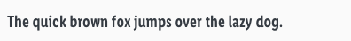
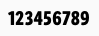
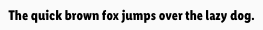
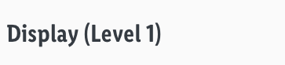

<AlertWarning alertHeadline="Not modifiable">
It is mandatory to maintain the appearance and behavior of these components.
</AlertWarning>

# Typography

The Lidl Font was developed for the various topics and applications of Lidl's brand communication and represents the brand values and the brand core on a typographical level.

It helps you to present your design and content as clearly and effectively as possible according to the Lidl standard.

---

## Typefaces

- The Lidl Font Condensed Pro looks **informative**, **useful** and **efficient**.
- In combination, they represent the variety of topics and actions and, at the same time, are **100% Lidl**.
- **Capital letters are not allowed**. The **only exceptions** are sections heads and buttons.
- All types of headings should primarily be used in **single line scenarios**.
- Use any base color of **brand-primary**, **danger**, **success**, **info** or **warning** as text color as long as it has a high contrast ratio in interaction with backgrounds.

 
 
 

---

## Regular

- The line-height always is **140%**.
- It is mainly used, i. e. for body text, links, tables, lists, input fields, etc.

### Small

| Breakpoint | Font size | Preview |
|---|---|---|
| LG | 14px |  |
| MD-XS | 12px |  |

### Basic

| Breakpoint | Font size | Preview |
|---|---|---|
| LG | 18px |  |
| MD-XS | 16px |  |

### Large

| Breakpoint | Font size | Preview |
|---|---|---|
| LG | 22px | |
| MD-XS | 20px |  |

---

## Semibold

- The line-height always is **140%**.
- It is mainly used, i. e. for headlines, labels, highlights.

### Small Bold

| Breakpoint | Font size | Preview |
|---|---|---|
| LG | 14px |  |
| MD-XS | 12px |  |

### Basic Bold

| Breakpoint | Font size | Preview |
|---|---|---|
| LG | 18px |  |
| MD-XS | 16px |  |

### Large Bold

| Breakpoint | Font size | Preview |
|---|---|---|
| LG | 22px |  |
| MD-XS | 20px |  |

### Brand Claim

- Brand Claim is the company's customer approach.
- It is positioned next to the Lidl logo in the header component.
- It is always shown in **brand-primary-base**.
- The line-height always is **120%**.

| Breakpoint | Font size | Preview |
|---|---|---|---|
| LG | 18px |  |
| MD-XS | 16px |  |

### Button text

- The text-style is only used in our button component.
- The line-height is **120%.**

| Breakpoint | Font size | Preview |
|---|---|---|---|
| LG | 18px |  |
| MD-XS | 16px |  |

---

## Bold

- The line-height always is 100%.
- It is mainly used for priceboxes and their addons.

### Small (pricebox)

- These font sizes are for a small pricebox which is used on our product tile on our search result page.

| Breakpoint | Font size | Preview |
|---|---|---|
| LG | 36px |  |
| MD+SM | 28px |  |
| XS | 20px |  |

### Medium (pricebox)

- These font sizes are for a medium pricebox which is used on our product detail page.

| Breakpoint | Font size | Preview |
|---|---|---|
| LG | 44px |  |
| MD+SM | 36px |  |
| XS | 28px |  |

### Addon (pricebox)

- These font sizes are only used for additional text of our pricebox, i.e. prefix, currency, recommended retail price (rrp).

| Breakpoint | Font size | Preview |
|---|---|---|
| LG | 14px |  |
| MD-XS | 12px |  |

---

## Page headlines

- The page headlines are displayed in 5 levels.
- All levels have different font sizes.
- There are fixed font sizes from level 5 to level 1.
- The typeface always is **semibold**.
- The line-height always is **120%**.

### Page headline (Level 1)

| Breakpoint | Font size | Preview |
|---|---|---|
| LG | 34px | 
| MD-XS | 32px |  |

### Page headline (Level 2)

| Breakpoint | Font size | Preview |
|---|---|---|
| LG | 30px |  |
| MD-XS | 28px |  |

### Page headline (Level 3)

| Breakpoint | Font size | Preview |
|---|---|---|
| LG | 26px |  |
| MD-XS | 24px |  |

### Page headline (Level 4)

| Breakpoint | Font size | Preview |
|---|---|---|
| LG | 22px |  |
| MD-XS | 20px |  |

### Page headline (Level 5)

| Breakpoint | Font size | Preview |
|---|---|---|
| LG | 18px |  |
| MD-XS | 16px |  |

---

## Displays

- The display text-style is defined in 5 levels.
- All levels have different font sizes.
- There are fixed font sizes from level 5 to level 1.
- The typeface is always **semibold**.
- The line-height is always **120%**.

### Display (Level 1)

| Breakpoint | Font size | Preview |
|---|---|---|
| LG | 56px | 
| MD-XS | 32px |  |

### Display (Level 2)

| Breakpoint | Font size | Preview |
|---|---|---|
| LG | 52px |  |
| MD-XS | 28px |  |

### Display (Level 3)

| Breakpoint | Font size | Preview |
|---|---|---|
| LG | 48px |  |
| MD-XS | 24px |  |

### Display (Level 4)

| Breakpoint | Font size | Preview |
|---|---|---|
| LG | 44px |  |
| MD-XS | 20px |  |

### Display (Level 5)

| Breakpoint | Font size | Preview |
|---|---|---|
| LG | 40px |  |
| MD-XS | 16px |  |

---

## Section headlines

- Section headlines have only one size and font.
- It matches level 4 of the page headlines, but is written in capital letters.
- The text of a section headline is always centered on the screen.
- The typeface always is **semibold**.
- The line-height always is **120%**.

| Breakpoint | Font size | Preview |
|---|---|---|
| LG | 22px |  |
| MD-XS | 20px |  |

---

## Lists

- Lists are used for text structuring.

| Type | Attributes | Preview |
|---|---|---|
| Bullets | Bulletpoints are special text characters whose form depends on the system. Size and color depend on the font style of the copy text. |  |
| Numbered | Numbers are text characters of the font. Size and color depend on the font style of the copy text. | 

---

## Spacing & Measurements

| Type | Attributes | Preview |
|---|---|---|
| Vertical spacing | 32px between **Page headline (Level 1)** and other headlines or body text  16px between **Page headline (Level 2)** and other headlines or body text  8px between **Page headline (Level 3)** and other headlines or body text  32px between body text and body text or headlines  8px between **Page headline (Level 4)** and other headlines or body text  8px between **Page headline (Level 5)** and other headlines or body text |  |
| Vertical spacing | 16px between **Section headline (Level 1)** and body text  32px between body text and body text or headlines |  |

---

## Our workflow in Sketch

- All text-styles are included in our CAKE UI Core file.
- With Sketch v51.2 text-styles can always be linked to this document.
- Use only these styles!
