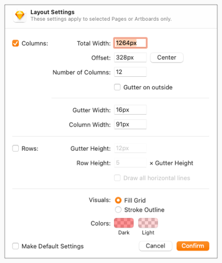
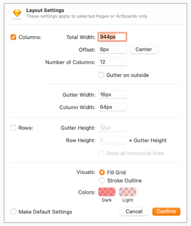
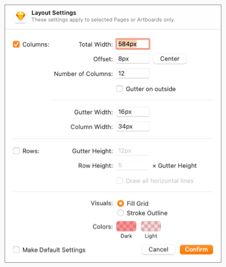

<AlertWarning alertHeadline="Not modifiable">
It is mandatory to maintain the appearance and behavior of these components.
</AlertWarning>

# Grid system

A grid system can be used to align and size objects within a given format.

---

## Usage

- Basic rules that help you set up your pages in sketch.
- The responsive behavior of our grid has four breakpoints.
- The amount, width and spacing of the columns change with each breakpoint.
- **Exception!** The global header and footer live outside the bounds of the grid.

---

|  1. Columns | 2. Gutters | 3. Margins |
|---|---|---|
| Content is placed in the areas of the screen that contain columns.  The number of displayed columns is determined by the breakpoint that is choosen. | Gutters are the spaces between columns.  They help separate content and have a **fixed value** of 16px for all breakpoints. | Margins are the space between content and the left and right edges of the screen. They have **fixed values** (16px or 32px) for XS, SM and MD breakpoint and **flexible values** for LG breakpoint (16px minimum). |

---

## Settings in Sketch

| Artboard | LG | MD | SM  | XS |
|---|---|---|---|---|
| Viewport | 1920px | 960px | 600px | 360px |
| Columns | 12 columns | 12 columns | 12 columns | 4 columns |
| Gutters | 16px | 16px | 16px | 16px |
| Offset (Margins) | 336px / 336px | 32px / 32px | 32px / 32px | 16px / 16px |
| Layout settings |  |  |  |  |
