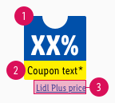
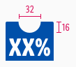
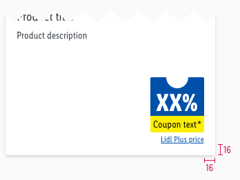

<AlertWarning alertHeadline="Not modifiable">
 It is mandatory to maintain the appearance and behavior of these components.
</AlertWarning>

# Coupon

Use this component if there is no possibility to display a specific product pricebox because the discount relates to a complete category or offer.

> Use it **only to promote LIDL Plus offers**  and only in combination with a **product tile, teaser or image**.

---

## Overall styling

- The text-style is **pricebox-small** and **small**.
- The text-color is **basic-white** and **basic-black**.
- The color of the upper part always is **brand-primary-base**.
- The color of the lower part always is **mark-base**.
- The background has **rounded corners of 2px**.

---

## Recommendations

- Keep the text short and **single line**.

---

## Spacing & measurements

| Types | Attributes | Preview |
|---|---|---|
| Horizontal spacing | 4px |  |
| Vertical spacing | padding-top: 18px / 10px (LG, MD+SM / XS) padding-bottom: 2px|  |
| Height | 24px Text horizontally centered |  |
| Circle size | 32x16px (LG, MD+SM) 16x8px (XS) |   |

---

## Position & combinations

- The coupon is placed in the **lower right corner** instead of a pricebox.
- The distance of the coupon to the borders of the product tile is **16px** each.
- It **can be displayed** in combination with a LIDL Plus ribbon.

