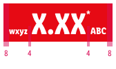
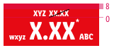
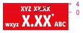
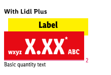
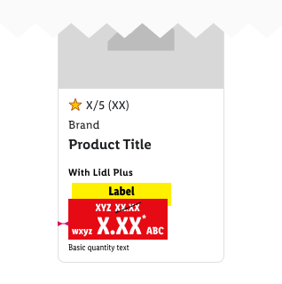

<AlertWarning alertHeadline="Not modifiable">
 It is mandatory to maintain the appearance and behavior of these components.
</AlertWarning>

# Pricebox

Use this component **only to promote LIDL Plus price** to the customer.  
Use the color combination danger-base / mark-base and the label "With Lidl Plus" to communicate a coherent price visualisation for Lidl Plus. If there is a need to combine an discount price for customers  who don't have Lidl Plus, please use the color combination basic-white / danger-base and label text  "Price without Lidl Plus".

> Usage of the LIDL Plus price **must be coordinated with and permitted by the legal department of your LIDL country**.

---

## Elements

| Attributes | Preview |
|---|---|
| 1. Label “With Lidl Plus”   2. Label   3. Recommended retail price (rrp)   4. LIDL Plus Pricebox   5. Basic quantity ||

---

## Overall styling

### Pricebox

- The text-style is [pricebox-small](../../General/Typography/Typography.md#pricebox-small) or [pricebox-medium](../../General/Typography/Typography.md#pricebox-medium) for the two possible sizes of the price.
- The text-style is [pricebox-addon](../../General/Typography/Typography.md#pricebox-addon) for asterisk, currency & prefix.
- The text-color is **basic-white**.
- The background-color is **danger-base**.
- The line-height is set to **default**.
- There are **two variant alignemnt** of this component for different purposes, **left-aligned** and **right-aligned**.
- For each breakpoint, you can select a corresponding symbol with different price text sizes to suit your layout.
- Additionally you can choose between a pricebox with or without prefix.
- Keep the text short and **single line**.
- Always show the Lidl Plus label with the wordings "With Lidl Plus".

| Size | Usage | Preview |
|---|---|---|
| Small | i.e. product overview | |
| Medium | i.e. product detail page | |

### Label

- The text-style is always [pricebox-label](../../General/Typography/Typography.md#pricebox-label).
- The line-height is set to **default**.
- The label is a required addon for the complete **LIDL Plus price**.

| Attributes | Preview |
|---|---|
| text-color: basic-back   background-color: mark-base |  |

### Legal info

The text style for label "With Lidl Plus" is font-family: "Lidl Font Pro";  
- LG: font-size: 13px; font-style: normal; font-weight: 600; line-height: 20px; letter-spacing: 0.25px; 
- SM-MD: font-size: 11px; font-style: normal; font-weight: 600; line-height: 16px; letter-spacing: 0.3px; 
- XS: font-size: 11px; font-style: normal; font-weight: 600; line-height: 16px; letter-spacing: 0.3px; 
- it is always positioned as first information. 

> The legal info is a required addon for the complete **LIDL Plus Price** communication and has a fix notation of "Lidl Plus price".

| Attributes | Preview |
|---|---|
| text-color: info-base |  

### Basic quantity

- The text-style is always [pricebox-basic-quantity](../../General/Typography/Typography.md#pricebox-basic-quantity).
- The line-height is set to **default**.
- It's used as additional info for the packaging unit, quantity or drained weight.

| Attributes | Preview |
|---|---|
| text-color: basic-black |  |

### Discount

- The text-style is always [pricebox-addon](../../General/Typography/Typography.md#pricebox-addon) for the recommended retail price (rrp).
- The line-height is set to **default**.
- The positive discount is a required addon for the complete **LIDL Plus price**.

| Attributes | Preview |
|---|---|
| text-color: basic-white   strike-color: basic-black |  |

---

## Spacing & measurements

- The height of the pricebox depends on the content and the additional components shown.
- The width of the pricebox depends on the content.

### Pricebox

| Types | Attributes | Preview |
|---|---|---|
| Vertical spacing | LG: 6px / 4px   MD+SM: 6px / 4px  XS: 4px / 2px |    |
| Horizontal spacing | LG: 8px / 4px   MD+SM: 8px / 4px  XS: 4px / 4px |    |

### Label

- The width of the label depends on the content of the pricebox.
- The height of the label is fixed for a single-line text.

| Types | Attributes | Preview |
|---|---|---|
| Vertical spacing |  LG: 4px / 12px MD+SM: 4px / 12px XS: 2px / 10px |    |
| Horizontal spacing | LG: 8px MD+SM: 8px XS: 4px |    |
| Height | LG: 34px MD+SM: 32px XS: 26px |    |

### Discount

| Types | Attributes | Preview |
|---|---|---|
| Discount | LG: 8px / 0px MD+SM: 8px / 0px  XS: 4px / 0px |    |

### Legal info & basic quantity

| Types | Attributes | Preview |
|---|---|---|
| Legal info | text and pricebox align right   margin-top: 2px |    |
| Basic quantity | text and pricebox align right   margin-top: 0px |  |

---

## Position & combinations

> Use it only in combination with a **product tile, teaser or image**.

- The pricebox is placed in the **lower left corner**.
- The distance of the price to the borders of the product tile margins.

## Example

Variants of visualisation Price with Lidl Plus

