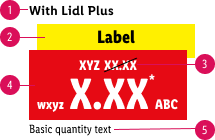
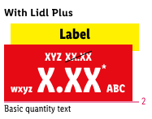
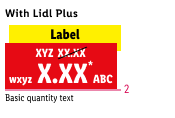

<AlertWarning alertHeadline="Not modifiable">
 It is mandatory to maintain the appearance and behavior of these components.
</AlertWarning>

# Pricebox

Use this component **only to promote a special Lidl Plus price** to the customer.

> The usage of the Lidl Plus pricebox **must be coordinated with and permitted by the legal department of your Lidl country**.

---

## Overall styling

The Lidl Plus pricebox is a combination of different single elements:

1. [Pricebox / Offer](../../Components/Pricebox/Pricebox.md#overall-styling)
2. [Label / Info](../../Components/Pricebox/Pricebox.md#label)
3. [RRP / Positive](../../Components/Pricebox/Pricebox.md#discount)
4. [Basic quantity](../../Components/Pricebox/Pricebox.md#basic-quantity)

---

## Recommendations

- You have to create the complete pricebox out of the **Lidl Plus pricebox**, **rrp** and **basic quantity** symbol due to a Sketch rescaling problem.

---

## Spacing & measurements

- All the single spacing and measurements for every component can be found under the standard [pricebox](../../Components/Pricebox/Pricebox.md#spacing--measurements).

| Types | Attributes | Preview |
|---|---|---|
| Discount | LG: 8px / 0px MD+SM: 8px / 0px  XS: 4px / 0px |    |
| Basic quantity | text and pricebox align right   margin-top: 2px |  |

---

## Position & combinations

> Use it only in combination with a **product tile, teaser or image**.

- The pricebox is placed in the **lower right corner**.
- The distance of the pricebox to the borders of the product tile is **16px** each.
- The component **can be displayed** in combination with a Lidl Plus ribbon.

